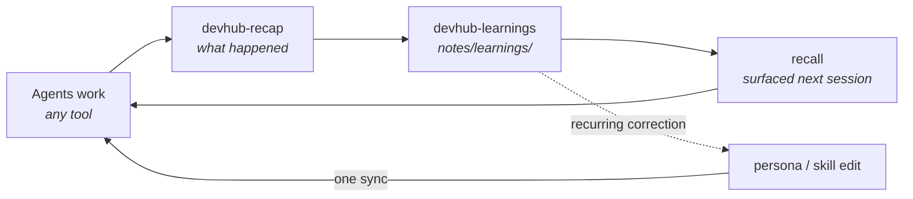

# devhub

**A control layer that makes AI coding agents consistent, persistent, and self-improving across Claude Code, Codex CLI, Cursor, OpenCode, and Antigravity.**

Every AI coding tool is feral by default: each one has its own idea of your standards, forgets everything between sessions, and repeats the mistake you corrected yesterday. DevHub defines who your agents are, what they know, what they can touch, and what they've learned — once, in git — and syncs it into every tool you use.

## By the numbers

Counted from this repo, not estimated.

|             |                                                                                      |
| ----------- | ------------------------------------------------------------------------------------ |
| **29**      | shared skills, defined once in `skills/shared/` and synced into every supported tool |
| **136**     | MCP tools agents can call — notes, tasks, repos, PRs, recall, databases, scripts     |
| **5**       | tools kept in lockstep: Claude Code, Codex CLI, Cursor, OpenCode, Antigravity         |
| **~500**    | tokens of always-on persona — standards everywhere without eating the context window |
| **381**     | test files guarding the sync engine, dashboard, and MCP server                       |
| **5 months** | of daily dogfooding since April 2026 — 840+ commits                                 |

## What it controls

| Pillar                | What it does                                                                                 | Lives in                    |
| --------------------- | -------------------------------------------------------------------------------------------- | --------------------------- |
| **Persona**           | Who the agents are and which engineering standards they enforce. Layered to keep tokens low. | `persona/`                  |
| **Skills & agents**   | What the fleet knows how to do — reviews, PRs, incident triage, repo onboarding.             | `skills/shared/`, `agents/` |
| **Memory**            | Distilled learnings and notes in plain files, retrievable by any agent via MCP.              | `notes/`                    |
| **Access**            | Which MCP servers each tool gets, with paths resolved per machine at sync time.              | `mcp/`, `mcp-servers/`      |
| **The learning loop** | Corrections become learnings; recurring learnings become rules; one sync ships them.         | see below                   |

Change one coding standard, run one sync, and it's enforced in every tool. A new engineer clones the repo, runs install, and inherits every standard and lesson already captured.

### The learning loop



1. **Work** — agents follow the persona, use shared skills, and read/write context through the DevHub MCP server.
2. **Recap** — `devhub-recap` summarizes a session: commands, file changes, failures, mutations.
3. **Distill** — `devhub-learnings` turns the reusable part into a learning note, committed to git.
4. **Recall** — the next session pulls relevant learnings back in via hybrid retrieval over notes, docs, and task history.
5. **Promote** — a correction that keeps recurring becomes a persona rule or skill change, synced to every tool.

A human approves what becomes a rule. Nothing rewrites your persona behind your back.

## Why it holds up

- **Vendor-neutral.** Standards and learnings live in your repo, not in any AI vendor's product. When the tool landscape churns, what you've accumulated moves with you.
- **Knowledge that outlasts people.** Lessons are captured in git, not in someone's head. When people leave, the lessons stay.
- **Local-first and guarded by default.** Services bind to `127.0.0.1`. Every mutating API route requires a same-origin request or a shared secret. Secrets come from 1Password or env, never the repo, and a leak scanner runs in CI and pre-push. The in-app terminal is never exposed to the network.
- **Extensible without forking.** Team- or company-specific skills, agents, and MCP servers ship as [plugins](docs/architecture/plugins.md) in separate repos.

## Quick Start

### Prerequisites: Node 22

DevHub pins **Node 22 (npm 10)** — see `.nvmrc`. npm 11 rewrites `package-lock.json` in a
shape CI's npm 10 rejects, so `npm install` refuses to run on the wrong major. If you use
[nvm](https://github.com/nvm-sh/nvm):

```bash
nvm install   # reads .nvmrc
nvm use       # switch this shell to Node 22
```

`npm run dev`, `build`, `test`, and `lint` work on any Node ≥ 20 — only `npm install` /
`npm ci` are gated, since they're the commands that rewrite the lockfile.

### Safe-Chain (recommended)

DevHub recommends [Aikido Safe-Chain](https://github.com/AikidoSec/safe-chain) to block
malicious npm packages. It's optional for the core template, but **some plugins require it**
(the BI plugin does — see [plugin requirements](docs/architecture/plugins.md#requirements)).
Install once per machine:

```bash
npm install -g @aikidosec/safe-chain@1.1.10
safe-chain setup
```

Restart your terminal so npm/yarn/pnpm are guarded. Verify:

```bash
npm install safe-chain-test   # should be blocked
```

### 1Password secrets (recommended before first run)

DevHub can start without integration secrets, but a useful fresh machine wants the 1Password CLI ready before `npm run dev`. Startup checks call `op` and can load missing managed secrets from a 1Password item named `devhub`.

Install and sign in once:

```bash
# macOS example; use the official 1Password CLI install for other platforms.
brew install --cask 1password-cli
op signin
```

Create or sync an item named `devhub` with fields named exactly like the env vars DevHub needs, for example `GOOGLE_CLIENT_ID`, `GOOGLE_CLIENT_SECRET`, `GOOGLE_REFRESH_TOKEN`, `JIRA_DOMAIN`, `JIRA_EMAIL`, `JIRA_API_TOKEN`, `DATADOG_API_KEY`, `DATADOG_APPLICATION_KEY`, and `AI_API_KEY`.

To keep 1Password as the source of truth instead of caching secrets into `dashboard/.env.local`, set this in your shell before starting DevHub:

```bash
export DEVHUB_OP_CACHE=0
```

The `/setup` page still helps confirm which integrations are configured after the app boots. If `op` is missing, not signed in, or the `devhub` item cannot be found, `npm run doctor` prints the same diagnosis without starting the dashboard.

### Install and run

```bash
# Clone the repo
git clone git@github.com:jmcelreavey/devhub.git ~/dev/devhub
cd ~/dev/devhub

# Installs dashboard deps (root postinstall → dashboard); dashboard postinstall
# bootstraps .env.local, notes dirs, and git hooks.
npm install

# Run the dashboard
npm run dev          # hot reload, recommended for day-to-day
# npm run start      # production build (faster, no reload)

# Open and configure optional integrations from /setup
open http://localhost:1337   # macOS — on Linux/WSL: xdg-open http://localhost:1337
```

You can still run `npm install` / `npm run dev` inside `dashboard/` if you prefer.

Optional **bootstrap** from the repo root: `bash scripts/install.sh` installs dashboard deps, then runs a **TypeScript** bootstrap (`dashboard/scripts/bootstrap-install.ts`) — skill + persona sync, MCP configs, DevHub MCP server deps (plus any plugin MCP server deps), production build, validation. Day-to-day sync is from the **Actions** and **Skills** pages in the app.

After install, start a session in any supported AI tool. It will automatically read `AGENTS.md` at the repo root and load your persona.

`install.sh` is **idempotent** — re-running it safely reinstalls deps and re-runs bootstrap. For deps-only refresh: `npm install` at the repo root (or `cd dashboard && npm install`).

---

_Everything below is reference documentation. The full docs live in [`docs/`](docs/README.md)._

## Dashboard (DevHub)

A Next.js-based personal dev dashboard (default `http://localhost:1337`) — the cockpit for the control layer above.

> **Trusted network only.** Mutating dashboard APIs (POST/PUT/PATCH/DELETE)
> require either a matching `Origin` (browser same-origin) or `DEVHUB_API_SECRET`
> via `X-DevHub-Secret` (MCP / local tooling). Missing `Origin` alone is **not**
> enough. Enforced globally for every `/api` route by `dashboard/proxy.ts`, so
> new routes are guarded by default. Use DevHub on a LAN you control (home Wi‑Fi) or lock it to this machine
> (below). Do not expose it to the public internet. The Actions page can spawn
> whitelisted scripts on your machine — set `DEVHUB_API_SECRET` (see `.env.example`)
> if anything other than your browser talks to the dashboard.

DevHub keeps the local services on `127.0.0.1` so the desktop app can always use `http://localhost:1337`. Use **Setup** (`/setup`) — checkbox _Allow access from other devices on my network_ — to add LAN access. LAN mode starts a small proxy on the detected physical LAN IPv4 and forwards ports `1337` and `1336` back to localhost. OpenCode is an ephemeral loopback instance (not 1338) and is not proxied. Port `1339` (the terminal) is deliberately **not** proxied — it is an unauthenticated PTY, and exposing a shell to your network is not something LAN mode should do. The `auto` detector excludes Tailscale/VPN CGNAT addresses (`100.64.0.0/10`) by default.

**WSL2:** LAN traffic hits **Windows** first. DevHub exposes a LAN proxy inside Linux; you still need Windows to accept and route it.

1. **Mirrored networking (recommended, Windows 11 22H2+):** Put this in `%USERPROFILE%\.wslconfig` (create the file if needed), then run `wsl --shutdown` and open your distro again:

```ini
[wsl2]
networkingMode=mirrored
```

Microsoft documents [Hyper-V firewall rules](https://learn.microsoft.com/en-us/windows/wsl/networking#mirrored-mode-networking) you may need once so inbound LAN connections reach WSL. Use your **Windows** Wi‑Fi/Ethernet IPv4 on other devices (not the old `172.x` WSL-only address).

2. **Default NAT mode:** From **elevated** Windows PowerShell, run the repo script (path via `\\wsl$\…` works from Windows):

```powershell
powershell.exe -ExecutionPolicy Bypass -File "\\wsl$\YOUR_DISTRO_NAME\home\YOU\dev\devhub\scripts\wsl\forward-devhub.ps1"
```

That sets `netsh` portproxy for ports **1337** and **1336** plus a firewall rule. Re-run after reboot if your phone can’t connect anymore.

`npm run dev` prints a WSL reminder when relevant.

Features:

- **Today page** — Tasks with Jira key detection + due dates, notes editor, calendar widget, ticket widget, daily activity digest; **Copy standup** (markdown for Slack: git **subjects** in `REPO_ROOT` over the same local window, **Jira** issues still assigned to you with any update in that window, **GitHub PRs you authored** that merged in that window via `gh pr list`, **GitHub PRs you reviewed** (merged, not your own) via `gh api search/issues`, tasks with **due date = today**); **GitHub PRs** (open + review queue via `gh pr status` across devhub and sibling clones with a `github.com` remote when the GitHub CLI is logged in)
- **Calendar** — Week view with Google Calendar integration (optional)
- **Tickets** — Jira Cloud tickets with status filters (optional)
- **Notes** — BlockNote editor, file tree, search overlay, folder-scoped **master checklists** (shared task blocks across notes), optional **in-editor AI** via z.ai (`/ai`, selection toolbar — see env vars below)
- **Recall** — Hybrid retrieval over notes, docs, learnings, task history, and an append-only event spine (`/recall`; see `docs/architecture/recall.md`)
- **Own** — Repo ownership radar for repositories you mark accountable for — inbound PRs, obligations, knowledge gaps, catch-up digests (`/own`, GitHub-gated; see `docs/guides/repo-ownership.md`)
- **Chamber** — OpenChamber iframe on port `1336` (Chamber manages its own OpenCode)
- **OpenCode** — OpenCode web UI iframe, lazy-started on an ephemeral loopback port (never 1338)
- **Terminal** — in-app PoC terminal backed by a local PTY peer on port `1339`
- **Datadog** — `/datadog` hub + Today strip (deep links to monitors by `@oncall-dad` / `@slack-dad-team-alerts` and today’s event stream) when `DATADOG_API_KEY` is set in `/setup`
- **Status** — Git/repo health, services, MCP server processes, restarts; same **GitHub PRs** strip as Today
- **Skills** — Expandable skill cards with SKILL.md content
- **Actions** — Script runner with run history
- **Command palette (`Cmd+P`)** — Search across notes, tasks, tickets, navigation, **copy standup markdown**, and related actions in one box
- **Auto-refresh** — Calendar / Jira / repos revalidate on tab focus and every minute
- **Toast errors with retry** — Failed saves surface as actionable toasts (no more silent failures)
- **Undo on task delete** — 5s undo window on the toast before the delete is committed
- **Keyboard shortcuts** — Press `?` when the **DevHub** document has focus for the full list (g+h/n/s/a/r/k/c/j/l/d nav, Cmd+P palette, Cmd+N notes, Cmd+T tasks, Cmd+D diagrams, Ctrl+` terminal, etc.). The **Chamber** iframe does not receive those keys — use the **Shortcuts** button on the Chamber page or open OpenChamber in a new tab.
- **Atomic file writes** — In-process mutex + temp-and-rename, so concurrent task toggles never lose data and a crash mid-write can't corrupt your notes

A starter `dashboard/.env.example` is checked in — copy to `dashboard/.env.local` and fill in the optional integration vars. The dev server runs a startup health check (`predev`/`prestart`) that verifies env vars and paths and fails fast with a clear message if something's missing.

### Dashboard Setup & Env Vars

`dashboard`’s `postinstall` (or `install.sh`) creates `dashboard/.env.local` from `dashboard/.env.example` and fills in `NOTES_DIR` / `REPO_ROOT` automatically; if it is still missing, `predev` / `prestart` bootstraps a minimal file so the server can start. If the 1Password CLI is installed and signed in, startup also tries to load missing managed secrets from the `devhub` item before the app binds ports. Configure or verify optional integrations from [http://localhost:1337/setup](http://localhost:1337/setup). `npm run setup` prints a short reminder to use `/setup` in the browser. Variables you might want to know about:

**Core (auto-configured by `npm install` at the repo root or in `dashboard/` via `postinstall`, or by `install.sh`):**
| Var | Default | Description |
|-----|---------|-------------|
| `NOTES_DIR` | `~/dev/devhub/notes` | Notes storage path |
| `REPO_ROOT` | `~/dev/devhub` | Repository root |
| `PORT` | `1337` | Dashboard port |
| `DEVHUB_BIND_HOST` | `127.0.0.1` | Next.js listen address; keep localhost for the desktop app |
| `DEVHUB_LAN_PROXY_HOST` | unset | Optional LAN proxy bind host. Use `auto` to pick a physical LAN IPv4 and exclude Tailscale CGNAT |
| `OPENCHAMBER_HOST` | `127.0.0.1` | OpenChamber local bind address; LAN access is proxied when enabled |
| `TERMINAL_PORT` | `1339` | In-app terminal PTY WebSocket peer |

**Google Calendar (optional):**
| Var | Required | How to Get |
|-----|----------|------------|
| `GOOGLE_CLIENT_ID` | Yes | [Google Cloud Console](https://console.cloud.google.com/) → OAuth 2.0 Client ID |
| `GOOGLE_CLIENT_SECRET` | Yes | Same as above |
| `GOOGLE_REFRESH_TOKEN` | Yes | Optional manual paste; otherwise use **Sign in with Google** on `/setup` (callback writes it) |

Calendar setup steps:

1. Go to https://console.cloud.google.com/
2. Create project or select existing
3. Enable "Google Calendar API"
4. Create OAuth 2.0 credentials (**Web application** so you can set a redirect URI, or otherwise allow the redirect you use below)
5. Under **Authorized redirect URIs**, add the exact URL you use to open DevHub, e.g. `http://localhost:1337/api/calendar/auth/callback` — if you use a LAN hostname or IP, add that variant too (`http://YOUR_LAN_HOST:1337/api/calendar/auth/callback`).
6. In [http://localhost:1337/setup](http://localhost:1337/setup) → Google Calendar: enter Client ID and Secret, click **Sign in with Google**. The callback writes `GOOGLE_REFRESH_TOKEN` (and the redirect URI used) into `dashboard/.env.local`; no copy/paste token step.
7. Restart only after changing repo paths / network bind (`npm run dev` / `npm run start` reload); integration keys written from `/setup` are picked up immediately in the running dashboard.

**Jira Cloud (optional):**
| Var | Required | How to Get |
|-----|----------|------------|
| `JIRA_DOMAIN` | Yes | Your Jira Cloud domain (e.g., `yourcompany.atlassian.net`) |
| `JIRA_EMAIL` | Yes | Your Jira email |
| `JIRA_API_TOKEN` | Yes | [Atlassian API Token](https://id.atlassian.com/manage-profile/security/api-tokens) |
| `NEXT_PUBLIC_JIRA_DOMAIN` | No | Same domain as `JIRA_DOMAIN`; used client-side for JIRA links in PR copy messages. Defaults to `example-org.atlassian.net`. |

**Datadog (optional):** `DATADOG_API_KEY` is saved from `/setup` (used by skills and to unlock the Datadog nav entry). Datadog’s **Events** REST API expects **both** an API key and an [application key](https://docs.datadoghq.com/account_management/api-app-keys/) — the API key alone is not enough for read/search endpoints we use for counts. Deep links default to US1 (`datadoghq.com`); override as needed:

| Var                           | Required                 | Description                                                                                                                                   |
| ----------------------------- | ------------------------ | --------------------------------------------------------------------------------------------------------------------------------------------- |
| `DATADOG_API_KEY`             | For Datadog UI in DevHub | From `/setup` — enables `/datadog` and the Today strip                                                                                        |
| `DATADOG_APPLICATION_KEY`     | For 24h alert counts     | Optional in `/setup` — Events v2 API (`events_read`). Same role as `DD_APPLICATION_KEY` or shell `DATADOG_APP_KEY` (DevHub checks all three). |
| `DD_SITE`                     | No                       | Datadog site (e.g. `datadoghq.com`, `datadoghq.eu`, `us3.datadoghq.com`) — drives the app hostname for links                                  |
| `DATADOG_APP_ORIGIN`          | No                       | Full origin override (e.g. `https://us3.datadoghq.com`) if link base should not be inferred from `DD_SITE`                                    |
| `DATADOG_LINK_ONCALL`         | No                       | Full URL override for the **@oncall-dad** monitor list                                                                                        |
| `DATADOG_LINK_TEAM_ALERTS`    | No                       | Full URL override for the **@slack-dad-team-alerts** monitor list                                                                             |
| `DATADOG_LINK_EVENTS_TODAY`   | No                       | Full URL override for “today’s events” (otherwise local midnight → now on `/event/stream`)                                                    |
| `DATADOG_EVENTS_QUERY_ALERTS` | No                       | Events search query for **all** monitor alerts in the last 24h (default `source:alert`)                                                       |
| `DATADOG_EVENTS_QUERY_ONCALL` | No                       | Events query for **@oncall-dad** slice (default `source:alert "@oncall-dad"`)                                                                 |
| `DATADOG_EVENTS_QUERY_TEAM`   | No                       | Events query for **@slack-dad-team-alerts** slice (default `source:alert "@slack-dad-team-alerts"`)                                           |

**Notes and Repo Learning AI (optional):** not on `/setup` - add to `dashboard/.env.local` from `dashboard/.env.example`:

Works with any OpenAI-compatible provider (z.ai by default, or OpenAI, OpenRouter, a local Ollama/LM Studio server, etc.):

| Var           | Required | Description                                                       |
| ------------- | -------- | ---------------------------------------------------------------- |
| `AI_API_KEY`  | Yes      | API key for your provider                                        |
| `AI_BASE_URL` | No       | OpenAI-compatible base; defaults to `https://api.z.ai/api/coding/paas/v4` |
| `AI_MODEL`    | No       | Defaults to `glm-5-turbo` (e.g. `gpt-4o-mini` for OpenAI)        |

Restart the dev server after setting these. See [docs/reference/environment-variables.md](docs/reference/environment-variables.md#notes-and-repo-learning-ai-optional).

### Keyboard Shortcuts

Press `?` when DevHub (not the Chamber iframe) has focus to see all shortcuts:

| Shortcut      | Action                  |
| ------------- | ----------------------- |
| `g + h`       | Go to Today             |
| `g + w`       | Go to Work (tasks, Jira, history) |
| `g + p`       | Go to PRs               |
| `g + n`       | Go to Notes             |
| `g + s`       | Go to Status            |
| `g + a`       | Go to Actions           |
| `g + r`       | Go to Repos             |
| `g + k`       | Go to Skills            |
| `g + c`       | Go to Chamber           |
| `g + l`       | Go to Calendar          |
| `g + j`       | Go to Tickets           |
| `g + d`       | Go to Datadog           |
| `Cmd+P`       | Toggle command palette  |
| `Cmd+N`       | Notes panel  |
| `Cmd+T`       | Tasks panel  |
| `Cmd+D`       | Diagrams panel  |
| `Ctrl+``      | Toggle terminal dock  |
| `Cmd+Shift+O` | Toggle notes side panel |
| `Cmd+Shift+T` | Toggle tasks side panel |
| `Cmd+\`       | Toggle sidebar          |
| `Esc`         | Close panel/modal       |

On viewports where the slim mobile header is shown, it includes **notes** and **tasks** buttons (same panels as the shortcuts above). On wider screens, use the shortcuts or open **Notes** from the sidebar.

## Persona System

The persona is split into three layers to minimize token usage:

| Layer | File                        | Size        | When Loaded                                                  |
| ----- | --------------------------- | ----------- | ------------------------------------------------------------ |
| L0    | `persona/identity.txt`      | ~200 tokens | Every message (Cursor `.mdc`; not inlined in `AGENTS.md`)    |
| L1    | `persona/shared-persona.md` | ~300 tokens | Every session (same)                                         |
| L2    | `persona/modes/*.md`        | ~80–190 each | On demand — open the matching mode file, not a wrapper skill |

**Why split?** L0/L1 stay short and load once. L2 is a single mode file when teaching/review/greenfield actually needs it — not a wrapper skill, not the whole modes directory.

Persona is delivered to AI tools via two mechanisms:

1. **Cursor `.mdc` + tool configs** — `syncPersona()` writes full L0/L1 into Claude/Codex/OpenCode/Antigravity marker blocks and always-on Cursor rules under `~/.cursor/rules/devhub-persona-*.mdc`.
2. **Repo `AGENTS.md`** — Cloud/plugin/gotcha rules plus L0/L1 **pointers**. Cursor already has the full text from `.mdc`; inlining both would load it twice.

### Customizing Your Persona

Edit the files in `persona/` directly. After editing, use **Skills → Persona & Agent configs → Sync persona** in the dashboard (or **Actions → Sync Persona**).

## Notes System (Persistent Memory)

Notes are plain files in the repo — BlockNote JSON under `notes/`, synced across machines with `git push` / `git pull` like everything else. No external database.

- **Learnings** (`notes/learnings/`) — short, reusable lessons written by the `devhub-learnings` skill or by hand. This is the tier agents should reach for.
- **Working notes** (`notes/`) — task notes, PR reviews, discovery, research, diagrams.
- **Recall** — hybrid retrieval over notes, docs, learnings, and task history. Agents query it through the `recall` MCP tool; humans use `/recall`. See [docs/architecture/recall.md](docs/architecture/recall.md).

Session recaps are on request only (`devhub-recap`) — agents should not volunteer them. See [docs/architecture/notes-system.md](docs/architecture/notes-system.md) and [docs/architecture/memory.md](docs/architecture/memory.md).

## Skills

Shared skills live in `skills/shared/`. Each skill has a `SKILL.md` describing when and how to use it. Skills are synced from the repo to your local tool directories by **TypeScript** (`dashboard/lib/sync/skills.ts`), triggered from the **Skills** or **Actions** UI.

### A few of the built-in skills

| Skill                  | Purpose                                                              |
| ---------------------- | -------------------------------------------------------------------- |
| **devhub-recap**       | Summarize a session: commands, MCP calls, file changes, failures     |
| **devhub-learnings**   | Distill a reusable lesson into `notes/learnings/`                    |
| **rubber-duck**        | Independent second-opinion review of the current plan or direction   |
| **pr-explain-review**  | Explain and review a PR with its conversation and linked ticket      |
| **dx-audit**           | Developer-experience audit of any repo, written to notes             |
| **devhub-sync**        | Keep core, private mirror, and plugin repos in sync                  |

The **Skills** page lists all of them.

### Reverse Skill Sync

If you create new skills locally (e.g., `~/.claude/skills/my-new-skill/`), use **Actions → Collect Skills** in the dashboard. Optional comma-separated **Exclude** names apply to both Collect and Sync (see Actions page). This copies new skills into `skills/shared/` and stages them with git.

### Creating Custom Skills

In the app: **Skills → New skill** (creates `skills/shared/<id>/SKILL.md`). Or add a directory by hand:

1. Create `skills/shared/your-skill/`
2. Add `SKILL.md` with `# Skill: your-skill` and When to Use / How to Use sections
3. Run **Sync skills** from the Skills page when you want tool copies updated

For AI-assisted creation of shared DevHub assets, use the `devhub-create-shared-x` skill. It covers shared skills, persona guidance, agents, and MCP server configs.

## Plugins

Skills, agents, and MCP configs can also come from **plugins** — separate repos (often private, e.g. `devhub-bi`) that contribute assets without living in the core repo. They merge at sync time with **core winning on name collisions**, and plugin assets are read-only inside DevHub (edit them in the plugin repo).

Register a plugin in a machine-local file (never committed):

```jsonc
// ~/.config/devhub/plugins.json
{
  "plugins": [
    { "name": "bi", "path": "~/Developer/devhub-bi", "enabled": true },
  ],
}
```

Each plugin repo has a `devhub-plugin.json` manifest declaring what it contributes. To build one, follow [docs/contributing/creating-plugins.md](docs/contributing/creating-plugins.md); for the design, see [docs/architecture/plugins.md](docs/architecture/plugins.md). This generalises the older single `ai-tools` skill merge.

### Fork workflow

If you run DevHub as a private mirror of a shared core, `scripts/devhub-update.sh` pulls core updates from your `upstream` remote and re-syncs, and `scripts/devhub-backport.sh` builds a clean PR back to core (personal data excluded). See [CONTRIBUTING.md](CONTRIBUTING.md).

## MCP Servers

MCP (Model Context Protocol) servers extend tool capabilities. This repo configures the **DevHub MCP server** for all supported tools, and plugins can contribute their own (the `bi` plugin ships a **DevHub BI MCP server**).

### DevHub MCP Server

A stdio MCP server (`mcp-servers/devhub-server`, wired from `mcp/shared/devhub.json`) exposes two tiers of tools:

- **Filesystem-backed** (work without the dashboard): notes, docs, tasks, diagrams, appraisal.
- **Dashboard-backed** (proxy `http://localhost:1337`): status, scripts/sync, briefing, calendar, work/PRs, repos, search, recall, databases. These need the dashboard running.

```bash
# Run the server directly (normally launched by your AI tool via the synced MCP config)
NOTES_DIR=~/devhub/notes DOCS_DIR=~/devhub/docs \
  mcp-servers/devhub-server/node_modules/.bin/tsx mcp-servers/devhub-server/src/mcp.ts
```

MCP configs are installed to your tool directories by `install.sh` / Actions with the correct paths. The config substitutes `REPO_ROOT` (and `PLUGIN_ROOT` for plugin servers) at sync time. See the `devhub-mcp` skill for tool usage and [docs/architecture/mcp-server.md](docs/architecture/mcp-server.md) for the design.

## Sync Strategy

### Conflict Prevention

**Update & Sync** (Actions) runs TypeScript (`dashboard/lib/sync/orchestrator.ts`): clean tree required for pull/collect/push; branch must be `main` or `master`; if you are **ahead and behind** remote, it stops until you rebase/merge. Advanced: skip the remote staleness guard from CLI with `cd dashboard && npx tsx scripts/run-action.ts update_and_sync --push --force` (not exposed in the UI).

See **Status → Repo** for live **dirty / ahead / behind** counts and suggested `git` commands when something blocks sync.

### Typical Sync Flow

- Use **Actions → Update & Sync** for pull + sync + optional commit/push.
- Use **Actions → Validate** or **`npm run verify`** in `dashboard/` for lint/typecheck/tests.

### Periodic Auto-Sync

The dashboard has an **in-process scheduler** (while the Next.js server is running) with cron-style jobs. Configure it from **Actions → Scheduled Jobs**. There is no separate host cron requirement.

CLI equivalent when you need it:

```bash
cd dashboard && npx tsx scripts/run-action.ts update_and_sync --push
```

## Validation

Repo integrity checks run in TypeScript (`dashboard/lib/validate.ts`). Run them from **Actions → Validate** in the app, or:

```bash
cd dashboard && npx tsx scripts/run-action.ts validate
```

## Platform Support

See [`docs/reference/platform-support.md`](docs/reference/platform-support.md) for the full matrix. Short version: **Node 20+** and **Git** on macOS or WSL; dashboard + sync actions are TypeScript; iOS is read-only for repo files.

## Workflow Summary

1. **Session start**: Cursor already has L0/L1 via `.mdc`; other tools get it from synced config blocks. Cloud agents read `persona/identity.txt` then `persona/shared-persona.md` if those rules are missing.
2. **During work**: agents use shared skills, follow persona standards, and pull context through `recall` and the notes tools.
3. **End of task**: ask for `devhub-recap` if you want a summary, and `devhub-learnings` for anything worth keeping.
4. **When a correction keeps recurring**: promote it into `persona/` or the relevant skill, then sync.
5. **Periodic**: optional **Scheduled Jobs** in the dashboard (in-process scheduler) can run Update & Sync / Validate while DevHub is running.

## Documentation

| Document                                | Purpose                                                        |
| --------------------------------------- | -------------------------------------------------------------- |
| `docs/README.md`                        | Docs home — start here                                         |
| `docs/architecture/overview.md`         | How the pieces fit together                                    |
| `docs/getting-started/installation.md`  | Full install guide                                             |
| `docs/architecture/memory.md`           | Memory architecture: git-based notes + notes MCP server        |
| `docs/architecture/persona-system.md`   | Persona layers and delivery                                    |
| `docs/architecture/token-budget.md`     | Token budget analysis and optimization tips                    |
| `docs/reference/platform-support.md`    | Platform capability matrix                                     |
| `docs/guides/repo-learning.md`          | Repos page learning briefs, tutor, and NotebookLM source packs |
| `docs/contributing/creating-plugins.md` | Step-by-step guide to building a plugin                        |
| `docs/architecture/plugins.md`          | Plugin system: manifest, registry, tier-1/tier-2, precedence   |
| `CONTRIBUTING.md`                       | Private-mirror + upstream + backport fork workflow             |

## Troubleshooting

**"Working tree is dirty" / diverged branch / blocked sync:** open **Status** — the Repo card lists dirty file count, ahead/behind, and suggested `git` commands. Fix in a terminal, then run **Actions → Update & Sync** again.

**MCP configs wrong or stale:** run `bash scripts/install.sh` from the repo root (rewrites MCP JSON with correct `REPO_ROOT` paths) or re-trigger bootstrap steps from the dashboard after changing paths in `/setup`.

**Skills not appearing in an AI tool:** **Skills → Sync skills** (optionally exclude specific skills). Streamed log shows each target directory.

**Persona not updating:** **Skills → Persona & Agent configs → Sync persona** (or **Actions → Sync Persona**).

**Validation / CI-style checks:** **Actions → Validate**, or `cd dashboard && npx tsx scripts/run-action.ts validate`.
