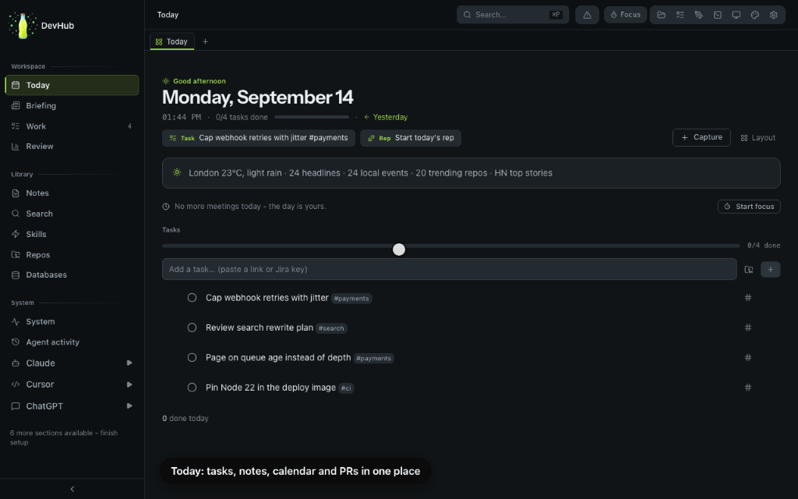
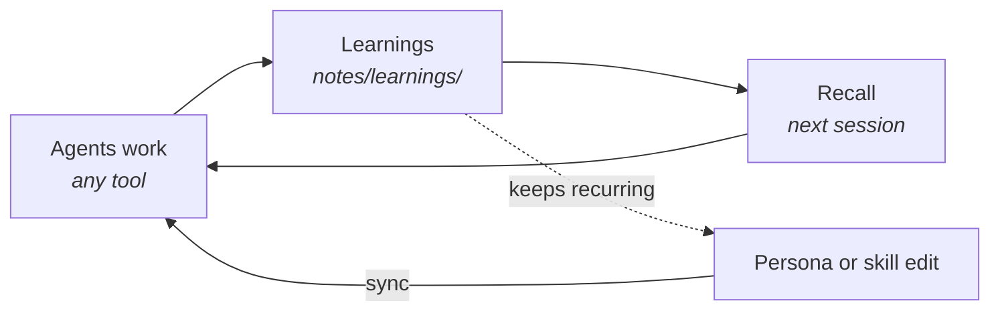

# DevHub

**One place to define how your AI coding agents work — synced into Claude Code, Codex, Cursor, OpenCode, and Antigravity — plus a local dashboard to work alongside them.**

Every AI coding tool starts from zero: its own idea of your standards, no memory of yesterday, and the same mistake you already corrected. DevHub keeps your persona, skills, agents, MCP servers, and notes in one git repo and syncs them into every tool you use.



<sub>Recorded against disposable demo data with `npm run demos:record`.</sub>

## What you get

- **One standard, every tool.** Write your engineering rules once in `persona/`. Sync writes them into each tool's native config, layered so the always-on part stays small.
- **Shared skills and agents.** `skills/` and `agents/` are copied into every tool that supports them — reviews, PR write-ups, incident triage, repo onboarding.
- **Memory that outlives the session.** Notes and learnings are plain files in git. Agents read and write them through the DevHub MCP server, and recall surfaces relevant ones in the next session, in any tool.
- **A dashboard for the rest of the day.** Tasks, notes, PRs, calendar, repos, a guarded database client, and a tab for each AI tool — local, in the browser or as a macOS app.
- **Plugins instead of forks.** Team- or company-specific skills, MCP servers, and dashboard pages live in [separate repos](docs/architecture/plugins.md).

## Quick start

Requires Node 22 (npm 10) and Git on macOS, Linux, or WSL2.

```bash
git clone https://github.com/jmcelreavey/devhub.git
cd devhub
nvm install && nvm use
npm install
npm run dev
```

Open http://localhost:1337, configure integrations from **Setup**, then click **Sync** on the **Skills** page. Start a session in any supported tool and it picks up your persona.

The [installation guide](docs/getting-started/installation.md) covers the recommended extras (Aikido Safe-Chain, 1Password-managed secrets) and the full bootstrap script. For the native app, see [the desktop app guide](docs/getting-started/desktop-app.md).

## How it fits together

| Directory       | What lives there                                     | Docs                                                    |
| --------------- | ---------------------------------------------------- | ------------------------------------------------------- |
| `persona/`      | Who your agents are and the standards they follow    | [Persona system](docs/architecture/persona-system.md)   |
| `skills/`       | Reusable workflows, one `SKILL.md` each              | [Skills](docs/guides/skills.md)                         |
| `agents/`       | Shared subagents                                     | [Agents](docs/guides/agents.md)                         |
| `mcp/`          | Which MCP servers each tool gets                     | [MCP server](docs/architecture/mcp-server.md)           |
| `notes/`        | Notes and learnings — the shared memory              | [Memory](docs/architecture/memory.md)                   |
| `dashboard/`    | The local Next.js dashboard                          | [Dashboard](docs/architecture/dashboard.md)             |

Edit any of those, sync, and every tool gets the change — from the dashboard, or from the CLI:

```bash
cd dashboard && npx tsx scripts/run-action.ts sync
```

### The learning loop



A correction becomes a learning note; one that keeps coming back becomes a persona rule or skill change. A human decides what becomes a rule. See [Recall](docs/architecture/recall.md).

## Security

DevHub is built for a single trusted machine. Services bind to `127.0.0.1`, every mutating API route needs a same-origin request or `DEVHUB_API_SECRET`, and the in-app terminal is never exposed to the network. Don't put it on the public internet. LAN access is opt-in — see [Setup](docs/getting-started/setup.md#localhost-vs-lan-access).

## Documentation

Everything else lives in [`docs/`](docs/README.md):

- [Architecture overview](docs/architecture/overview.md)
- [Sync engine](docs/architecture/sync-engine.md)
- [Environment variables](docs/reference/environment-variables.md)
- [Platform support](docs/reference/platform-support.md)
- [Command palette and shortcuts](docs/guides/command-palette.md)
- [Contributing and the fork workflow](CONTRIBUTING.md)
