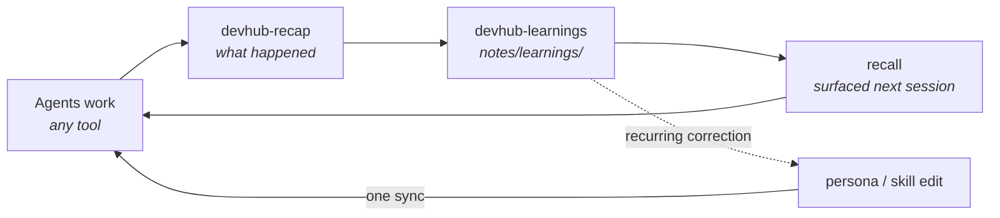

# devhub

**A control layer that makes AI coding agents consistent, persistent, and better over time — across Claude Code, Codex, Cursor, OpenCode, and Antigravity.**

Every AI coding tool is feral by default: each one has its own idea of your standards, forgets everything between sessions, and repeats the mistake you corrected yesterday. DevHub defines who your agents are, what they know, what they can touch, and what they've learned — once, in git — and syncs it into every tool you use.


<sub>Recorded against a throwaway checkout and home directory with `npm run demos:record`. `devhub` in the recording is a shell function wrapping `dashboard/scripts/run-action.ts` and `mcp-servers/devhub-server/scripts/call-tool.mjs`.</sub>

## By the numbers

Counted from this repo, not estimated.

|          |                                                                                         |
| -------- | --------------------------------------------------------------------------------------- |
| **5**    | AI tools kept in lockstep: Claude Code, Codex, Cursor, OpenCode, Antigravity             |
| **36**   | skills (29 shared, 7 vendored), synced into 11 tool skill directories by one command     |
| **144**  | MCP tools agents can call — notes, tasks, repos, PRs, recall, databases, scripts         |
| **5**    | shared subagents, synced into every tool that supports them                             |
| **~500** | tokens of always-on persona — standards everywhere without eating the context window    |
| **381**  | test files guarding the sync engine, dashboard, and MCP server                          |

## What it controls

| Pillar                | What it does                                                                                 | Lives in                    |
| --------------------- | -------------------------------------------------------------------------------------------- | --------------------------- |
| **Persona**           | Who the agents are and which engineering standards they enforce. Layered to keep tokens low. | `persona/`                  |
| **Skills & agents**   | What the fleet knows how to do — reviews, PRs, incident triage, repo onboarding.             | `skills/`, `agents/`        |
| **Memory**            | Notes and distilled learnings in plain files, retrievable by any agent over MCP.             | `notes/`                    |
| **Access**            | Which MCP servers each tool gets, with paths resolved per machine at sync time.              | `mcp/`, `mcp-servers/`      |
| **The learning loop** | Corrections become learnings; recurring learnings become rules; one sync ships them.         | see below                   |

Change one coding standard, run one sync, and every tool enforces it. A new engineer clones the repo, runs install, and inherits every standard and lesson already captured.

### The learning loop



1. **Work** — agents follow the persona, use shared skills, and read/write context through the DevHub MCP server.
2. **Recap** — `devhub-recap` summarizes a session: commands, file changes, failures, mutations.
3. **Distill** — `devhub-learnings` turns the reusable part into a learning note, committed to git.
4. **Recall** — the next session pulls relevant learnings back in via hybrid retrieval over notes, docs, and task history.
5. **Promote** — a correction that keeps recurring becomes a persona rule or skill change, synced to every tool.

A human approves what becomes a rule. Nothing rewrites your persona behind your back.

## Why it holds up

- **Vendor-neutral.** Standards and learnings live in your repo, not in any AI vendor's product. When the tool landscape churns, what you've accumulated moves with you.
- **Local-first and guarded by default.** Services bind to `127.0.0.1`. Every mutating API route requires a same-origin request or a shared secret. Secrets come from 1Password or env, never the repo, and a leak scanner runs in CI and pre-push. The in-app terminal is never exposed to the network.
- **Extensible without forking.** Team- or company-specific skills, agents, MCP servers, and dashboard pages ship as [plugins](docs/architecture/plugins.md) in separate repos.

## The app

The control layer comes with a cockpit: a local dashboard, in the browser at `http://localhost:1337` or as a native macOS app.

- **Workspace** — Today (tasks, notes, calendar, PRs, one-click standup), a morning Briefing, Calendar, Work (tasks, Jira, history), PRs, and a weekly Review.
- **Library** — BlockNote notes with shared checklists and in-editor AI, Docs, Search, [Recall](docs/architecture/recall.md), Learnings, Research, Radar, Appraisal and 1:1s, tldraw Diagrams, and [Live links](docs/guides/sharing.md) that publish a note as a secret Gist or a self-destructing link.
- **Agents and repos** — the skills, agents, persona, and MCP catalog with sync; [Repos](docs/guides/repo-learning.md) for cloning, learning an unfamiliar codebase, and starting it up; an [ownership radar](docs/guides/repo-ownership.md) for repos you're accountable for; and a guarded [database client](docs/architecture/database-client.md) for PostgreSQL, MongoDB, and SQLite.
- **Every AI tool in one window** — a terminal dock plus tabs for Claude, Cursor, ChatGPT/Codex, Antigravity, OpenCode, and [OpenChamber](docs/guides/opencode-and-chamber.md).
- **System** — Status, Logs, allowlisted Actions, [Scheduled Jobs](docs/guides/scheduled-jobs.md), and Setup.
- **Optional integrations** — [Google Calendar](docs/integrations/google-calendar.md), [Jira](docs/integrations/jira.md), [GitHub](docs/integrations/github.md), [Datadog](docs/integrations/datadog.md), and [Figma](docs/integrations/figma.md).

Press `⌘P` for the command palette and `?` for every shortcut.

## Quick Start

### Desktop app (macOS)

The native app bundles its own Node server. Build and install it from a checkout with `npm run desktop:build` and `npm run desktop:install` — see [the desktop app guide](docs/getting-started/desktop-app.md) for prerequisites and the Gatekeeper prompt on first launch.

### From source

#### Prerequisites: Node 22

DevHub pins **Node 22 (npm 10)** — see `.nvmrc`. npm 11 rewrites `package-lock.json` in a
shape CI's npm 10 rejects, so `npm install` refuses to run on the wrong major. If you use
[nvm](https://github.com/nvm-sh/nvm):

```bash
nvm install   # reads .nvmrc
nvm use       # switch this shell to Node 22
```

`npm run dev`, `build`, `test`, and `lint` work on any Node ≥ 20 — only `npm install` /
`npm ci` are gated, since they're the commands that rewrite the lockfile.

#### Safe-Chain (recommended)

DevHub recommends [Aikido Safe-Chain](https://github.com/AikidoSec/safe-chain) to block
malicious npm packages. It's optional for the core template, but **some plugins require it**
(see [plugin requirements](docs/architecture/plugins.md#requirements)).
Install once per machine:

```bash
npm install -g @aikidosec/safe-chain@1.1.10
safe-chain setup
```

Restart your terminal so npm/yarn/pnpm are guarded. Verify:

```bash
npm install safe-chain-test   # should be blocked
```

#### 1Password secrets (recommended before first run)

DevHub can start without integration secrets, but a useful fresh machine wants the 1Password CLI ready before `npm run dev`. Startup checks call `op` and can load missing managed secrets from a 1Password item named `devhub`.

```bash
# macOS example; use the official 1Password CLI install for other platforms.
brew install --cask 1password-cli
op signin
```

Create or sync an item named `devhub` with fields named exactly like the env vars DevHub needs, for example `GOOGLE_CLIENT_ID`, `GOOGLE_CLIENT_SECRET`, `JIRA_DOMAIN`, `JIRA_EMAIL`, `JIRA_API_TOKEN`, `DATADOG_API_KEY`, and `AI_API_KEY`. To keep 1Password as the source of truth instead of caching secrets into `dashboard/.env.local`, `export DEVHUB_OP_CACHE=0` before starting DevHub.

If `op` is missing, not signed in, or the `devhub` item cannot be found, `npm run doctor` prints the diagnosis without starting the dashboard.

#### Install and run

```bash
git clone git@github.com:jmcelreavey/devhub.git ~/dev/devhub
cd ~/dev/devhub

# Installs dashboard deps; postinstall bootstraps .env.local, notes dirs, and git hooks.
npm install

npm run dev          # hot reload, recommended for day-to-day
# npm run start      # production build (faster, no reload)

open http://localhost:1337   # macOS — on Linux/WSL: xdg-open http://localhost:1337
```

Configure optional integrations from `/setup` in the app. Then start a session in any supported AI tool — it reads `AGENTS.md` at the repo root and loads your persona.

Optional **bootstrap**: `bash scripts/install.sh` installs deps, then runs skill + persona sync, MCP configs, DevHub MCP server deps (plus plugin MCP deps), a production build, and validation. It is idempotent. Day-to-day sync lives on the **Actions** and **Skills** pages.

---

_Everything below is reference. The full docs live in [`docs/`](docs/README.md)._

## Security and network access

> **Trusted network only.** Mutating dashboard APIs (POST/PUT/PATCH/DELETE)
> require either a matching `Origin` (browser same-origin) or `DEVHUB_API_SECRET`
> via `X-DevHub-Secret` (MCP / local tooling). Missing `Origin` alone is **not**
> enough. Enforced globally for every `/api` route by `dashboard/proxy.ts`, so
> new routes are guarded by default. Do not expose DevHub to the public internet.
> The Actions page can spawn allowlisted scripts on your machine — set
> `DEVHUB_API_SECRET` (see `.env.example`) if anything other than your browser
> talks to the dashboard.

DevHub keeps local services on `127.0.0.1`. To reach it from other devices, tick _Allow access from other devices on my network_ on `/setup`: LAN mode starts a small proxy on the detected physical LAN IPv4 and forwards ports `1337` and `1336` back to localhost. OpenCode runs on an ephemeral loopback port and is not proxied. Port `1339` (the terminal) is deliberately **never** proxied — it is an unauthenticated PTY. The `auto` detector excludes Tailscale/VPN CGNAT addresses (`100.64.0.0/10`).

**WSL2:** LAN traffic hits **Windows** first, so Windows must accept and route it.

1. **Mirrored networking (recommended, Windows 11 22H2+):** add this to `%USERPROFILE%\.wslconfig`, then `wsl --shutdown` and reopen your distro:

   ```ini
   [wsl2]
   networkingMode=mirrored
   ```

   You may need Microsoft's [Hyper-V firewall rules](https://learn.microsoft.com/en-us/windows/wsl/networking#mirrored-mode-networking) once. Use your **Windows** Wi‑Fi/Ethernet IPv4 on other devices.

2. **Default NAT mode:** from **elevated** Windows PowerShell:

   ```powershell
   powershell.exe -ExecutionPolicy Bypass -File "\\wsl$\YOUR_DISTRO_NAME\home\YOU\dev\devhub\scripts\wsl\forward-devhub.ps1"
   ```

   That sets `netsh` portproxy for ports **1337** and **1336** plus a firewall rule. Re-run after a reboot if devices can't connect.

## Configuration

`npm install` creates `dashboard/.env.local` from `dashboard/.env.example` and fills in `NOTES_DIR` / `REPO_ROOT`. Integration keys are best set from `/setup`, which writes them into the running dashboard without a restart. Every variable — paths, ports, integrations, and the OpenAI-compatible provider used for in-editor and repo-learning AI — is documented in [docs/reference/environment-variables.md](docs/reference/environment-variables.md). Per-integration setup lives under [`docs/integrations/`](docs/integrations/).

## Keyboard shortcuts

Press `?` in DevHub for the full list.

| Shortcut              | Action                                    |
| --------------------- | ----------------------------------------- |
| `⌘P`                  | Command palette                           |
| `⌘N` / `⌘T` / `⌘D`    | Notes / tasks / diagrams side panel       |
| `⌘⇧C`                 | Quick capture (task, note, or learning)   |
| `⌘\`                  | Toggle sidebar                            |
| `⌘1`–`⌘9`             | Jump to workspace tab                     |
| ``Ctrl+` ``           | Toggle terminal dock                      |
| `g` then `h`          | Today                                     |
| `g` then `n` / `/` / `f` | Notes / Search / Diagrams              |
| `g` then `t` / `p` / `l` / `j` | Tasks / PRs / Calendar / Tickets |
| `g` then `r` / `k`    | Repos / Skills                            |
| `g` then `s` / `a` / `d` | Status / Actions / Datadog             |
| `Esc`                 | Close panel or modal                      |

## Persona System

The persona is split into layers to minimize token usage:

| Layer | File                        | Size          | When Loaded                                                  |
| ----- | --------------------------- | ------------- | ------------------------------------------------------------ |
| L0    | `persona/identity.txt`      | ~200 tokens   | Every message (optional, personal — not in the public core)  |
| L1    | `persona/shared-persona.md` | ~300 tokens   | Every session                                                |
| L2    | `persona/modes/*.md`        | ~80–190 each  | On demand — open the matching mode file, not a wrapper skill |

**Why split?** L0/L1 stay short and load once. L2 is a single mode file when teaching, review, or greenfield work actually needs it.

Persona is delivered two ways:

1. **Native tool configs** — sync writes L0/L1 into marker blocks in `~/.claude/CLAUDE.md`, `~/.codex/AGENTS.md`, `~/.opencode/AGENTS.md`, `~/.gemini/GEMINI.md`, and `~/.cursor/.cursorrules`, plus always-on Cursor rules under `~/.cursor/rules/devhub-persona-*.mdc`.
2. **Repo `AGENTS.md`** — cloud/plugin/gotcha rules plus L0/L1 **pointers**, so tools that already have the full text don't load it twice.

Edit the files in `persona/`, then click **Sync to all tools** in the persona panel on the Skills page (or **Actions → Sync Persona**). See [docs/architecture/persona-system.md](docs/architecture/persona-system.md).

## Notes System (Persistent Memory)

Notes are plain files in the repo — BlockNote JSON under `notes/`, synced across machines with `git push` / `git pull`. No external database.

- **Learnings** (`notes/learnings/`) — short, reusable lessons written by the `devhub-learnings` skill or by hand.
- **Working notes** (`notes/`) — task notes, PR reviews, discovery, research, diagrams.
- **Recall** — hybrid retrieval over notes, docs, learnings, and task history. Agents query it through the `recall` MCP tool; humans use `/recall`.

Session recaps are on request only (`devhub-recap`) — agents should not volunteer them. See [docs/architecture/notes-system.md](docs/architecture/notes-system.md) and [docs/architecture/memory.md](docs/architecture/memory.md).

## Skills

Shared skills live in `skills/shared/`; third-party skills live in `skills/vendor/` ([rules](docs/guides/vendored-skills.md)). Each has a `SKILL.md` describing when and how to use it. Sync copies them into every tool's skill directory — see [docs/guides/skills.md](docs/guides/skills.md).

| Skill                 | Purpose                                                            |
| --------------------- | ------------------------------------------------------------------ |
| **devhub-recap**      | Summarize a session: commands, MCP calls, file changes, failures   |
| **devhub-learnings**  | Distill a reusable lesson into `notes/learnings/`                  |
| **rubber-duck**       | Independent second-opinion review of the current plan or direction |
| **pr-explain-review** | Explain and review a PR with its conversation and linked ticket    |
| **dx-audit**          | Developer-experience audit of any repo, written to notes           |
| **devhub-sync**       | Keep core, private mirror, and plugin repos in sync                |

The **Skills** page lists all of them. Create one by adding `skills/shared/<name>/SKILL.md`. Skills you create directly in a tool (e.g. `~/.claude/skills/my-skill/`) can be pulled back into the repo with **Actions → Collect Skills**. For AI-assisted authoring, use the `devhub-create-shared-x` skill.

## Plugins

Skills, agents, MCP configs, and dashboard pages can also come from **plugins** — separate repos (often private) that contribute assets without living in the core repo. They merge at sync time with **core winning on name collisions**, and plugin assets are read-only inside DevHub.

Register a plugin in a machine-local file (never committed):

```jsonc
// ~/.config/devhub/plugins.json
{
  "plugins": [{ "name": "my-team", "path": "~/dev/devhub-my-team", "enabled": true }],
}
```

Each plugin repo has a `devhub-plugin.json` manifest. Build one with [docs/contributing/creating-plugins.md](docs/contributing/creating-plugins.md); the design is in [docs/architecture/plugins.md](docs/architecture/plugins.md).

### Fork workflow

If you run DevHub as a private mirror of a shared core, `scripts/devhub-update.sh` pulls core updates from your `upstream` remote and re-syncs, and `scripts/devhub-backport.sh` builds a clean change back to core with personal data excluded. See [docs/contributing/fork-workflow.md](docs/contributing/fork-workflow.md) and [CONTRIBUTING.md](CONTRIBUTING.md).

## MCP Servers

This repo configures the **DevHub MCP server** for every supported tool, and plugins can contribute their own.

A stdio server (`mcp-servers/devhub-server`, wired from `mcp/shared/devhub.json`) exposes two tiers of tools:

- **Filesystem-backed** (work without the dashboard): notes, docs, tasks, diagrams, appraisal.
- **Dashboard-backed** (proxy `http://localhost:1337`): status, scripts and sync, briefing, calendar, work and PRs, repos, search, recall, databases.

Sync installs the config into each tool with `REPO_ROOT` (and `PLUGIN_ROOT` for plugin servers) substituted. To call a tool without an AI client in the loop:

```bash
node mcp-servers/devhub-server/scripts/call-tool.mjs --list
node mcp-servers/devhub-server/scripts/call-tool.mjs notes_search '{"query":"lockfile"}'
```

See [docs/architecture/mcp-server.md](docs/architecture/mcp-server.md) and the `devhub-mcp` skill.

## Sync and validation

**Actions → Update & Sync** pulls, syncs skills, agents, MCP servers, and persona, and optionally commits and pushes. It requires a clean tree on `main`/`master` and stops if you're both ahead of and behind the remote — **Status → Repo** shows dirty/ahead/behind counts and the `git` commands to fix it. **Actions → Scheduled Jobs** runs these on a cron-style schedule while the dashboard is up.

CLI equivalents:

```bash
cd dashboard
npx tsx scripts/run-action.ts sync                     # skills + agents + MCP + persona
npx tsx scripts/run-action.ts update_and_sync --push   # pull, sync, commit, push
npx tsx scripts/run-action.ts validate                 # repo integrity checks
npm run verify                                         # lint, typecheck, tests, build
```

See [docs/architecture/sync-engine.md](docs/architecture/sync-engine.md).

## Platform Support

**Node 20+** and **Git** on macOS or WSL; the desktop app is macOS; iOS is read-only for repo files. Full matrix: [docs/reference/platform-support.md](docs/reference/platform-support.md).

## Workflow Summary

1. **Session start**: tools already have L0/L1 from synced configs. Cloud agents read `persona/identity.txt` then `persona/shared-persona.md` if those rules are missing.
2. **During work**: agents use shared skills, follow persona standards, and pull context through `recall` and the notes tools.
3. **End of task**: ask for `devhub-recap` if you want a summary, and `devhub-learnings` for anything worth keeping.
4. **When a correction keeps recurring**: promote it into `persona/` or the relevant skill, then sync.

## Documentation

| Document                                                                     | Purpose                                             |
| ---------------------------------------------------------------------------- | --------------------------------------------------- |
| [docs/README.md](docs/README.md)                                             | Docs home — start here                              |
| [architecture/overview.md](docs/architecture/overview.md)                    | How the pieces fit together                         |
| [getting-started/installation.md](docs/getting-started/installation.md)      | Full install guide                                  |
| [getting-started/desktop-app.md](docs/getting-started/desktop-app.md)        | The native macOS app                                |
| [architecture/persona-system.md](docs/architecture/persona-system.md)        | Persona layers and delivery                         |
| [architecture/memory.md](docs/architecture/memory.md)                        | Why memory is git-backed local files                |
| [architecture/recall.md](docs/architecture/recall.md)                        | Event spine, hybrid retrieval, and the recall graph |
| [architecture/token-budget.md](docs/architecture/token-budget.md)            | Keeping always-loaded guidance small                |
| [architecture/plugins.md](docs/architecture/plugins.md)                      | Plugin tiers, manifest, and precedence              |
| [reference/environment-variables.md](docs/reference/environment-variables.md) | Every variable DevHub reads                        |
| [contributing/recording-demos.md](docs/contributing/recording-demos.md)      | Recording sanitized demos                           |
| [CONTRIBUTING.md](CONTRIBUTING.md)                                           | Private-mirror, upstream, and backport workflow     |

## Troubleshooting

**"Working tree is dirty" / diverged branch / blocked sync:** open **Status** — the Repo card lists dirty files, ahead/behind, and suggested `git` commands. Fix in a terminal, then run **Actions → Update & Sync** again.

**MCP configs wrong or stale:** run `bash scripts/install.sh` from the repo root (rewrites MCP JSON with correct `REPO_ROOT` paths), or re-run sync after changing paths in `/setup`.

**Skills not appearing in an AI tool:** **Actions → Sync Skills**. The streamed log shows each target directory.

**Persona not updating:** **Sync to all tools** in the Skills page persona panel (or **Actions → Sync Persona**).

**Dashboard hanging or desktop app won't start:** see [docs/guides/desktop-recovery.md](docs/guides/desktop-recovery.md) or ask an agent to use the `devhub-debug-hang` skill.
