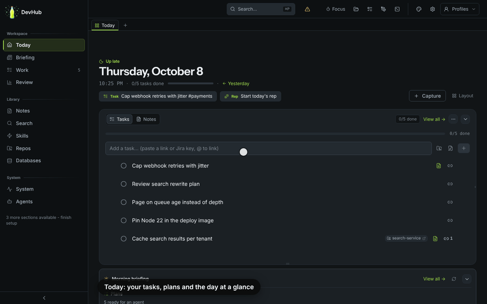
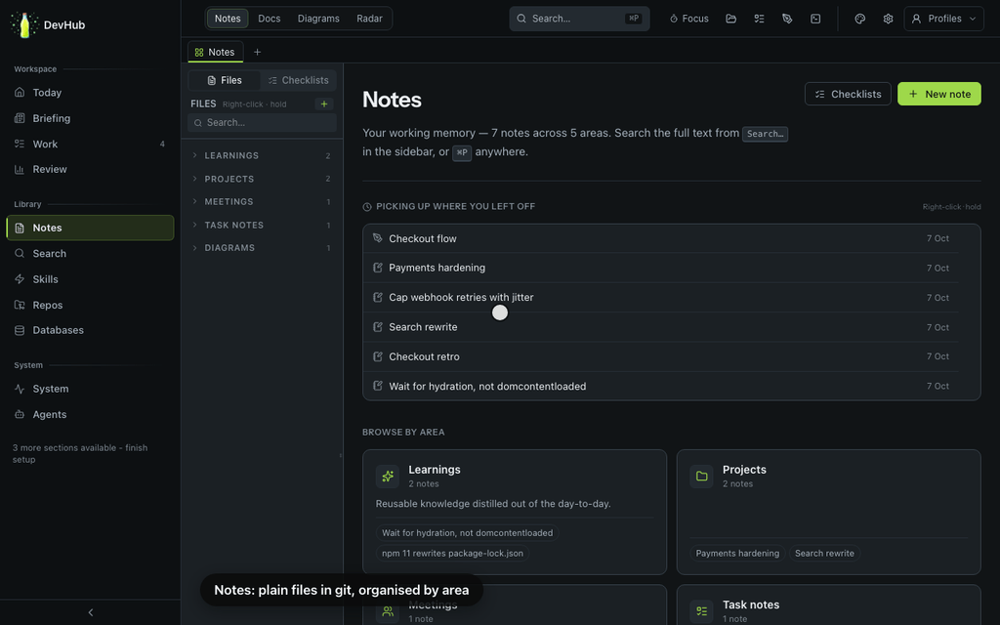

# DevHub

DevHub is a local dashboard for your working day as a developer: tasks, notes, pull requests, repos and your AI coding agents in one window. Everything is stored as files on your own machine, and GitHub, Jira, Google Calendar and the other integrations are optional. It also keeps your AI tools (Claude Code, Codex, Cursor, OpenCode and Antigravity) on the same skills and standards, so you set them up once.


<sub>Recorded against disposable demo data, not a real account.</sub>

## Install

Download the installer for your computer from the **[latest release](https://github.com/jmcelreavey/devhub/releases/latest)**. It includes DevHub's server and a Node runtime, so you don't need Node, npm or a clone of the repo. (Windows also needs WSL 2, covered below.)

| You have | Download |
| --- | --- |
| A Mac with Apple Silicon | the file ending `_aarch64.dmg` (`DevHub_<version>_aarch64.dmg`) |
| A Mac with an Intel chip | the file ending `_x64.dmg` (`DevHub_<version>_x64.dmg`) |
| Windows, 64-bit Intel or AMD (not Arm) | the file ending `_x64-setup.exe` (`DevHub_<version>_x64-setup.exe`) |
| Linux, 64-bit | the file ending `_amd64.AppImage` or `_amd64.deb` |

The file name includes the version. The [latest release](https://github.com/jmcelreavey/devhub/releases/latest) has the current files.

### Mac

1. Drag **DevHub** into **Applications** and eject the DMG, then double-click **DevHub** in **Applications**. You need macOS 13 or later. (**Apple menu → About This Mac** tells you which chip you have.)
2. macOS says **"DevHub" Not Opened** (Apple could not verify it is free of malware). Click **Done**. Don't click **Move to Trash**.
3. Open **System Settings → Privacy & Security**, scroll down to **Security**, and click **Open Anyway** next to *"DevHub" was blocked to protect your Mac*. In the next dialog click **Open Anyway** again, then enter your Mac password (or use Touch ID). You only do this once. On macOS 15 and later, right-click → Open no longer gets past this.

On a Mac managed by your company, policy can block apps like this. If **Open Anyway** doesn't appear, ask IT. More in [Unsigned installers](docs/getting-started/desktop-app.md#unsigned-installers).

### Windows

1. Run the file ending `_x64-setup.exe`. It installs for you only, so it doesn't need admin rights, and it fetches WebView2 if your PC doesn't have it.
2. Windows will probably say **Windows protected your PC**. That's SmartScreen, and it's expected: the installer isn't signed with a paid publisher certificate (that's on purpose), so Windows doesn't recognise the publisher. If you got the file from the release page, click **More info**, then **Run anyway**.
3. DevHub runs inside **WSL 2** (Windows Subsystem for Linux) with Ubuntu. If you don't have that yet, the first launch shows **Set up Windows support**. Click it and accept the one administrator prompt. Finish Ubuntu's account setup, restart if Windows asks, then open DevHub again. If you already have a WSL 2 Ubuntu, DevHub uses it.

Prefer to set WSL up by hand? Open PowerShell as administrator, run `wsl --install`, restart, then click **Try again** in DevHub.

Two things worth knowing:

- Smart App Control or a company policy can block unsigned apps with no **Run anyway** button. Ask your administrator rather than switching protection off.
- Windows is the newest build. It has been run on Windows 11 with WSL already set up. Setting WSL up from scratch on a clean machine hasn't had a full test yet, so please tell us if it goes sideways. [Windows app](docs/architecture/desktop-windows-wsl.md) says what has and hasn't been tested.

### Linux

Download the `.AppImage`, make it executable and run it. On Debian or Ubuntu you can install the `.deb` instead. Linux is the least documented platform so far.

## First run

DevHub shows a start-up screen for a few seconds while it starts its own server, then opens a setup wizard. It asks what you want DevHub for, which tools you have and where your code lives. Every step can be skipped, and **Set up later** takes you straight to the dashboard. Nothing is required: pages for GitHub, Jira, Calendar and the like stay hidden until you connect them.

You don't need Git, GitHub or a fork to start. [Getting started without Git](docs/getting-started/guided-setup.md) covers it, and the [FAQ](docs/getting-started/faq.md) has the short answers.

### Try this first

- Add a task on **Today** and tick it off.
- Write a note in **Notes** and link it to another one.
- Press **⌘P** (Ctrl+P on Windows and Linux) and jump to anything.
- Connect GitHub with **Setup → GitHub → Sign in with GitHub** to switch on **PRs**.

### Hollow (October only)

Every October, DevHub switches itself to **Hollow**, an optional spooky theme, the first time you open it. Not for you? Click the palette icon (**Appearance**) in the top bar and pick another theme. DevHub keeps your pick for the rest of the month. If you leave Hollow on, your old theme comes back when October ends. Jump scares and sound are off unless you turn them on, and the fog and creatures have their own switches in the same menu. See [Theming](docs/guides/theming.md#hollow-the-october-theme).

## A quick tour

### Today

Your day on one page: tasks, the plans that are ready for an agent to pick up, a morning briefing, and your calendar once Google Calendar is connected.



### Work

Every open task, filterable by tag, date or status, plus History for what got done, moved or abandoned. A Jira tab appears once Jira is connected, and **Review** gives you the week in numbers.


### PRs

Your pull requests, the ones waiting on your review, and ones you've reviewed lately. It needs GitHub: use **Setup → GitHub → Sign in with GitHub**. **Review with agent** saves a review as a note, and DevHub doesn't post it to GitHub.

### Notes

Files with a block editor: daily notes, meetings, projects and learnings, linked to each other and to your tasks, PRs and repos. Docs and Diagrams sit alongside.



### Agents

Chat with coding agents (Claude Code, Codex, OpenCode, Cursor, Copilot) and, where DevHub can read your sign-ins, see how much of each subscription you've used. It runs through a small local helper called Paseo. Install **Node.js**, then **Safe-Chain**, then **Paseo**, in that order, from **Setup → Tools** (Safe-Chain's install needs npm, which comes with Node.js). You can also open **Agents → Connection** once those are in place. Skip it and the rest of DevHub works as normal. See [Agents (Paseo)](docs/guides/paseo-agents.md).

### Skills

A skill is a reusable set of instructions for your AI tools. Write it once and DevHub copies it into Claude Code, Codex, Cursor, OpenCode and Antigravity. The **Persona** tab does the same for your engineering standards, and the **My voice** quiz teaches agents to write like you.


In the desktop app, **Sync skills** needs a linked DevHub checkout. Until you link one it says "No linked git checkout". Setup's optional private repo step creates one for you, and the other syncs don't need it. See [Git sync and linked checkouts](docs/getting-started/desktop-app.md#git-sync-and-linked-checkouts).

There's more: Repos with a git client, Databases (SQLite, Postgres and MongoDB) and full-text Search. The [feature tour](docs/guides/feature-tour.md) covers all of it.

## Plugins

A plugin is a separate repo that adds skills, agents, MCP servers, dashboard pages or database connections to DevHub without living in the core. That's how company-specific things stay out of the shared code. It's just a folder with a `devhub-plugin.json` in it.

In the app: **Plugins** (the top bar when you're on System, or the **Plugins** button on Skills) → **Add from GitHub**, paste the repo URL, review what it adds, then enable. Needs Git (on a Mac: **Install Git** / `xcode-select --install`). Skills and agents only for now; MCP servers and dashboard pages still need a checkout.

From a DevHub checkout, the same install is:

```bash
npm run plugins -- add <path-to-the-plugin>
npm run plugins -- list
```

`npm run plugins -- disable <name>` and `npm run plugins -- enable <name>` turn one off and on. The list of plugins is a machine-local file, `~/.config/devhub/plugins.json`. [Creating a plugin](docs/contributing/creating-plugins.md) has the manifest and the details, and [Plugin system](docs/architecture/plugins.md) explains how it works.

## Updates

DevHub checks for an update a little while after it starts and shows a banner if there is one. You choose when to download it and when to restart, and a failed update leaves what you have untouched. Updates are signed, and DevHub refuses one that doesn't verify.

You can also check yourself with **DevHub → Check for Updates…**, which is in the tray icon's menu too. Your notes and tasks live outside the app (on a Mac in `~/Library/Application Support/DevHub`, on Windows inside your Ubuntu under `~/.local/share/devhub`), so an update never touches them. On Linux the in-app updater covers the AppImage. If you installed the `.deb`, download the new one from the release page.

## Troubleshooting

- **macOS won't open DevHub.** See the Mac steps above: **System Settings → Privacy & Security → Open Anyway**.
- **Windows blocks the installer.** Use **More info → Run anyway**. If there's no such button, your organisation's policy is blocking it.
- **Windows says WSL isn't installed.** Open PowerShell as administrator, run `wsl --install`, restart, then click **Try again**. If you only have a WSL 1 distro, DevHub won't convert it, so run `wsl --set-version <distro> 2` yourself.
- **Windows: the window can't reach DevHub.** A `localhostForwarding=false` line in `%USERPROFILE%\.wslconfig` breaks the connection. Remove it and restart WSL.
- **"Port 1337 is in use".** Another program, or a second DevHub, has the port. DevHub only offers to stop a leftover DevHub development server of its own (**Stop it and continue**). Otherwise quit the other program, then click **Try again**.
- **A start-up error.** The window shows the last few log lines and an **Open logs** button.
- **Closing the window didn't quit DevHub.** It keeps running from the tray or menu-bar icon so scheduled jobs carry on. Choose **Quit DevHub** there.
- **Agents shows a connection error.** Paseo isn't set up yet. Install Node.js, then Safe-Chain, then Paseo from **Setup → Tools**. On Windows, WSL needs `systemd=true` in `/etc/wsl.conf` first.
- **An update failed.** Nothing changed. Click **Try again** or **Open release page**.

More in [Desktop recovery](docs/guides/desktop-recovery.md) and the [FAQ](docs/getting-started/faq.md).

## Feedback

Found a bug, or something confusing? [Open an issue](https://github.com/jmcelreavey/devhub/issues). It helps to include your operating system, your DevHub version (**DevHub → About DevHub**) and, for start-up problems, the log files (**View → Open Logs Folder**). Have a look through them for anything private before you attach them.

## Run it from source

For contributors, or if you'd rather not use the installer. You need Node 22 and Git.

```bash
git clone https://github.com/jmcelreavey/devhub.git
cd devhub
nvm install && nvm use
npm install
DEVHUB_BIND_HOST=127.0.0.1 npm run dev
```

Then open <http://localhost:1337>. [Installation](docs/getting-started/installation.md) covers the full bootstrap script and what to do if the desktop app already has that port. Run `npm run verify` before you open a PR. [CONTRIBUTING.md](CONTRIBUTING.md) explains the private mirror workflow that keeps personal notes and tasks out of the public repo.

## Security

DevHub is built for one person on a trusted machine. It listens on `127.0.0.1` by default, the terminal is never exposed to the network, and there is no login, so don't put it on the public internet. Opening it to your local network is opt-in: see [Setup](docs/getting-started/setup.md#localhost-vs-lan-access).

## Documentation

Everything else lives in [`docs/`](docs/README.md): the [feature tour](docs/guides/feature-tour.md), [architecture](docs/architecture/overview.md), [environment variables](docs/reference/environment-variables.md), [platform support](docs/reference/platform-support.md) and [contributing](CONTRIBUTING.md).

## Licence

[MIT](LICENSE)
