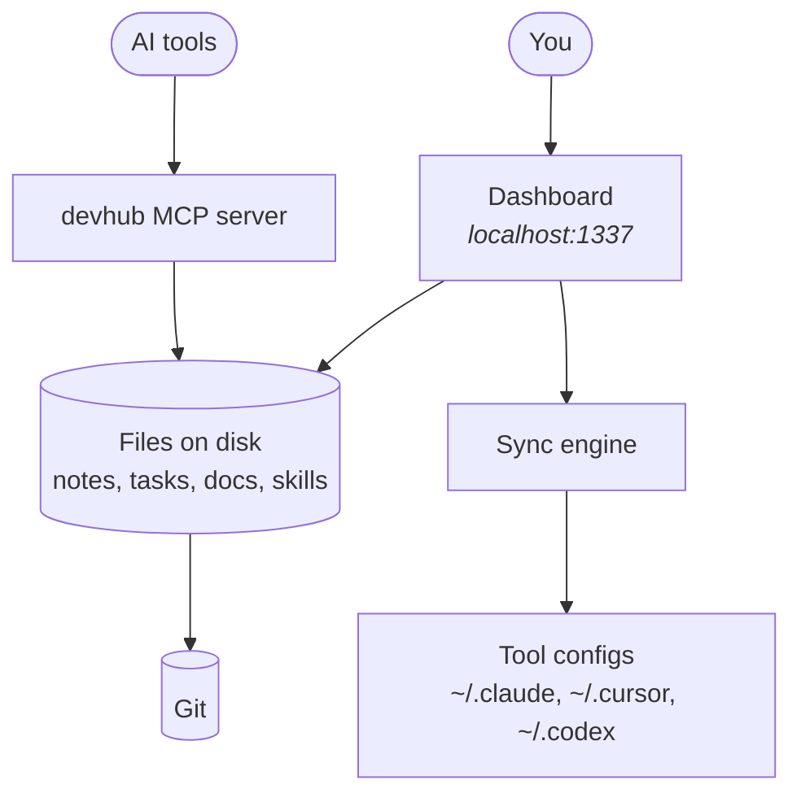

# DevHub Documentation

DevHub is a local-first workspace for managing AI coding tools, notes, tasks, integrations,
and shared agent configuration. It runs on your machine, stores everything as files, and
keeps those files in Git.

These docs describe the system at a stable concept level. Implementation details that churn
weekly live in the code; what you'll find here is the shape of things and why it is that
shape.

## How it fits together

Read [Architecture Overview](architecture/overview.md) for the full picture.

## Pick a path

| If you want to…                    | Start at                                          |
| ---------------------------------- | ------------------------------------------------- |
| Get it running                     | [Installation](getting-started/installation.md)   |
| Understand how it works            | [Architecture Overview](architecture/overview.md) |
| Do a specific task                 | [Skills](guides/skills.md) and the other guides   |
| Look something up                  | [API Routes](reference/api-routes.md)             |
| Extend it without forking the core | [Plugin System](architecture/plugins.md)          |
| Contribute back upstream           | [Fork Workflow](contributing/fork-workflow.md)          |

The sidebar has the full contents; every section is also listed on the docs home page.

## Conventions in these docs

Docs are Markdown files under `docs/`, editable in the app (**Edit** on any page) or in
your editor. A few conventions make the rendered site work:

- **Frontmatter drives navigation.** `title`, `description`, `section`, `order`, `icon`,
  `tags` and `related` control how a page appears in the nav, on cards, and in the
  related-docs footer.
- **Links are relative Markdown links.** `../guides/theming.md` renders as a working
  in-app link and still resolves on GitHub. Every such link also produces a backlink on
  the target page.
- **Diagrams are Mermaid.** Fenced `mermaid` code blocks render inline.
- **Callouts use GitHub syntax.** `> [!NOTE]`, `> [!TIP]`, `> [!IMPORTANT]`,
  `> [!WARNING]`, `> [!CAUTION]`.

> [!TIP]
> Adding a page is just adding a `.md` file in the right folder. The section, ordering,
> nav entry, search index, and backlinks all follow from the file and its frontmatter —
> there is no separate table of contents to keep in step.

For repo topology, mirror setup, and the personal-data boundary, see
[`CONTRIBUTING.md`](../CONTRIBUTING.md).
