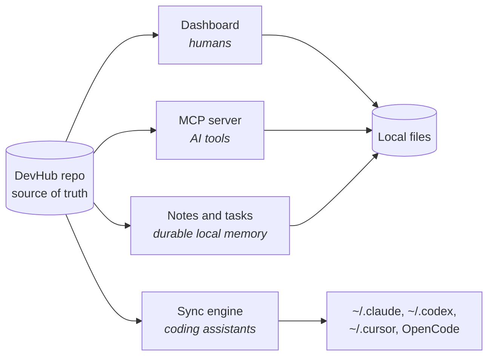

# Architecture Overview

DevHub is a local-first control center for AI-assisted development.

It brings together a dashboard, shared agent configuration, persistent notes, task tracking, and optional work integrations.

## Main Parts

| Part          | Role                                                                  |
| ------------- | --------------------------------------------------------------------- |
| Dashboard     | The local web app used day to day                                     |
| Notes storage | File-backed notes, tasks, learnings, and diagrams                     |
| MCP server    | Lets AI tools use DevHub filesystem data and dashboard-backed workflows |
| Sync engine   | Copies shared skills, persona, agents, and MCP configs to local tools |
| Desktop shell | Tauri app: owns the window, the process tree and updates (`desktop/`) |
| Integrations  | Calendar, Jira, Datadog, GitHub, and internal ops helpers             |

## Mental Model

One repo, four consumers. Everything else is plumbing between them.

The repo is the source of truth for shared configuration. Local tool directories receive
synced copies — never the other way round, unless you explicitly pull from a tool.

## Local-First Design

DevHub is built for one user on a trusted machine or trusted LAN.

There is no user login or session system. Mutating API routes are guarded globally by `dashboard/proxy.ts` via `requireDashboardAuth` (strict same-origin `Origin` **or** `X-DevHub-Secret` when `DEVHUB_API_SECRET` is set). Sensitive **GET** routes that need the same guard must enforce it per handler (OpenCode session recap does). See [API Routes — Common Behavior](../reference/api-routes.md#common-behavior) and [Environment Variables](../reference/environment-variables.md#core-variables).

Do not expose DevHub to the public internet without adding a proper perimeter auth layer on top of these guards.

## Data Storage

DevHub stores most user-owned data as files:

| Data             | Storage Style                            |
| ---------------- | ---------------------------------------- |
| Notes            | BlockNote JSON files                     |
| Diagrams         | tldraw JSON files                    |
| Tasks            | Daily JSON task files                    |
| Skills           | Markdown files in shared skill folders   |
| Persona          | Plain text and Markdown files            |
| Config templates | JSON files with environment placeholders |

This keeps the system portable, inspectable, and easy to sync with Git.

## Runtime Shape

During normal use, DevHub may run several local services:

| Service     | Default port | Typical role                                  |
| ----------- | ------------ | --------------------------------------------- |
| Dashboard   | `1337`       | Main web app                                  |
| OpenChamber | `1336`       | Embedded thinking/workspace UI                |
| OpenCode    | `1338`       | Shared coding assistant UI (also used by Chamber) |
| MCP server  | —            | Stdio server launched by AI tools when needed |

OpenChamber does not start its own OpenCode server when managed by DevHub (`OPENCODE_SKIP_START`). See [OpenCode and OpenChamber](../guides/opencode-and-chamber.md).

The dashboard can also run local actions, such as syncing skills or validating the repo.

## Design Priorities

- Keep configuration portable across machines.
- Keep memory readable and versionable.
- Prefer simple local files over external databases.
- Make tool setup repeatable instead of manual.
- Keep optional integrations optional.
