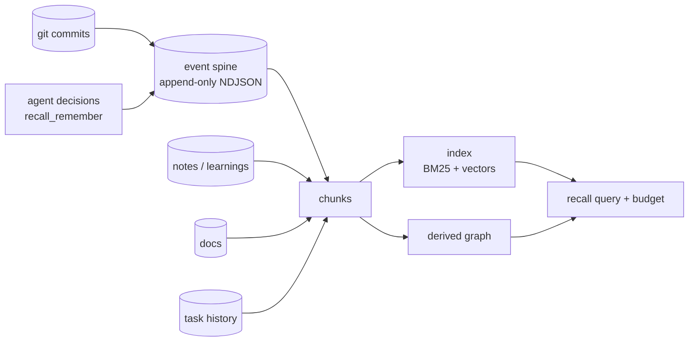

# Recall

DevHub ingests a great deal and recalls almost none of it.

Commits, PRs, ticket transitions, alerts, script runs and session failures all
flow through the dashboard, get rendered once, and are dropped. Meanwhile the
one tier explicitly built for reuse — `notes/learnings/` — holds roughly 23
entries against 295 notes, because writing one is a ten-step manual workflow
that depends on someone remembering to do it.

Recall closes that loop. It is the difference between a system whose value
scales with how disciplined you are about writing things down, and one whose
value scales with how much you work.

## The shape

Two stores, deliberately different in kind:

| Path | What | Durability |
| ---- | ---- | ---------- |
| `notes/.index/events/` | The event spine, sharded by month | **Durable.** A new source of truth; belongs in git |
| `notes/.index/recall/` | Chunks, vectors, manifest | **Derived.** Gitignored, safe to delete at any time |

Keeping them apart is what makes "the index is only a cache" true rather than
aspirational. Both live under a dot-directory, which every existing vault
walker already skips — so the index is invisible to the notes tree, the file
browser and the existing search without any of them being changed.

## Why not a vector database

[Memory architecture](memory.md) rejects vector stores on the grounds that they
are opaque and hard to audit. That objection holds against a *hosted* store and
does not apply here: every chunk records the `sourceId` it came from, files
remain canonical, and `rm -rf notes/.index/recall` is always safe because the
next query rebuilds in about 150 ms.

## Why not a real embedding model

The obvious move is `bge-small` through transformers.js. It was rejected for
the default path:

- 90–130 MB added to a desktop bundle already measured at 243 MB, for a corpus
  of ~300 notes.
- A model download on first run — a network dependency in a local-first app.
- Tens of seconds to index on CPU, so rebuilds stop being free, so they stop
  being automatic, so the index goes stale.

Instead the default embedder is hashed character trigrams, IDF-weighted and
L2-normalised. This is a **morphological** similarity space, not a semantic
one, and the distinction is stated plainly in `lib/recall/embed.ts`: it matches
"purge" to "purging" and "cache-invalidation" to "invalidate cache", and it
does not know that "lorry" means "truck". Paired with BM25 through rank fusion
it recovers most of what people want from semantic search over a personal
vault — robustness to the exact word you half-remember — at zero bytes of
model.

`Embedder` is the seam. The manifest records which embedder built the index and
a change forces a rebuild, so swapping in a real model later is a config
change, not a migration.

## Ranking

Four signals, combined in that order of importance:

| Signal | Source | Role |
| ------ | ------ | ---- |
| Lexical | BM25 over stemmed tokens | Exact terms, identifiers, ticket keys |
| Vector | Hashed-trigram cosine | Morphology and half-remembered phrasing |
| Recency | 90-day half-life | A six-month-old failure probably refers to dead code |
| Entity | Refs the query named | An exact ticket match should not lose to prose |

Lexical and vector are combined with **Reciprocal Rank Fusion** rather than a
weighted score sum. BM25 is unbounded and cosine is bounded to [-1, 1], so a
weighted sum of the raw numbers is just BM25 with rounding error. RRF fuses
positions instead, which is scale-free by construction.

Recency and entity are *priors* weighted an order of magnitude below fusion: a
chunk with a perfect ticket match but no textual relevance should place well,
not first.

## Result-set quality

Three caps, each added in response to a specific failure seen against the real
vault rather than reasoned about in advance:

- **Three chunks per file.** Without it a single long note wins every slot.
- **Near-duplicate suppression.** A rolled-over task lands in a different
  `tasks/YYYY-MM-DD.json` every day, so the per-file cap cannot see it. Detected
  by Jaccard over *non-numeric* vocabulary — dates and ids are exactly the
  volatile part — gated on identical entity refs so two different tickets
  described identically are never collapsed.
- **40% per source kind.** Even after deduplication, a ticket query filled most
  of its slots with daily task files, because each day carries a different mix
  of other tasks and those chunks are legitimately distinct. "This ticket was
  open for nine days" is not the answer to anything. Lifted when the caller
  explicitly asks for one kind.

## The derived graph

[`entity-links`](notes-system.md) resolves edges by reading `## Links` sections
somebody typed. That means a ticket key appearing in a branch name, a commit
message, a PR title and three notes produces exactly zero edges.

Recall derives them from co-occurrence across every indexed chunk, emitting the
same `EntityRef` contract so downstream consumers cannot tell the difference.
The two are complementary and kept separate: hand-written links carry intent,
co-occurrence carries evidence, and a regex must never overwrite a human's
stated relationship.

Precision is the rule. Full 40-character SHAs only (short ones are
indistinguishable from hex ids and produced ~40 junk entities per note in
testing), no bare-number issue matching, and chunks mentioning more than twelve
entities are excluded from edge-building — a release note listing forty tickets
would otherwise emit 780 edges describing a shared release, not a relationship.

## Surfaces

| Surface | Entry point |
| ------- | ----------- |
| UI | `/recall` — query, budget and keyword↔vector sliders, per-signal score breakdown (`grade.verdict` is API/MCP-only today) |
| API | `GET /api/recall`, `GET /api/recall/index`, `GET /api/recall/graph`, `POST /api/recall/index`, `POST /api/recall/ingest`, `GET/POST /api/recall/events` |
| MCP | `recall`, `recall_graph`, `recall_remember`, `recall_index` |

`recall` is the thing an agent should call first when it has a question.

### Relationship to the context pack

An earlier draft of this document said `recall` *replaces* `buildContextPack`.
That was half right, and the half it got wrong is worth keeping written down.

The criticism was accurate: the context pack chose learnings with
`.slice(0, 8)`, which is recency wearing relevance as a hat. It paid for eight
learnings when one mattered, and never surfaced the note from March that held
the answer.

But it does not follow that the route should be deleted in favour of
`/api/recall?q=…`. `recall` needs a query; the context pack is a **button**, and
the user clicking it expects today's context without first describing their own
day. Replacing it outright moves the work onto the user.

So `lib/context-pack.ts` now splits by what each half is actually good at:

| Part | Source | Why |
| ---- | ------ | --- |
| Open tasks, daily note, standup | Direct reads | Facts about today, not retrieval. There is no ranking question in "what tasks are open"; scoring them only adds ways to be wrong. |
| Learnings | `recall` | Ranked against a query synthesised from the facts above — task text, Jira keys, and the daily note. |

Jira keys enter the synthesised query twice, bare and via the task text that
mentions them, because `recall` scores on extracted entity refs; the bare key is
what makes a day of `PTF-3774` work surface the `PTF-3774` note.

Falling back to recency is a **normal path, not an error**: a fresh machine has
no index, and a day with no open tasks has nothing to be relevant to. Both cases
degrade to the old behaviour and say so, in the `learningSelection` field and in
the markdown heading — this output gets pasted into an agent, and a silent
fallback would read as the stronger claim.

## Grading — does the evidence support an answer?

`recall()` is a ranker, and ranking is relative: it returns the best twelve
chunks in the vault whether or not any of them are good. Ask about something
you have never written down and you still get twelve confident-looking
citations, because *best available* and *good enough* are different claims and
nothing in the pipeline distinguished them.

That matters most where recall feeds an agent rather than a human. A person
scanning twelve snippets notices when none are relevant; a model handed the
same twelve as "context" will build an answer on them.

`lib/recall/grade.ts` returns one of three verdicts:

| Verdict | Meaning |
| ------- | ------- |
| `answerable` | Hits share the question's terms, or carry an entity the question named |
| `weak` | Something came back, but the overlap is thin — cite, don't conclude |
| `no-evidence` | Nothing usable. The honest answer is "the vault doesn't have this" |

Three decisions worth recording:

**Deterministic, not a model call.** Same reasoning `embed.ts` used to refuse a
90 MB embedding model: a grader needing the network would make `recall` fail
differently depending on connectivity. A rubric over signals the ranker already
computed is weaker than an LLM but free, instant, testable, and *stable* — so a
refusal today is a refusal tomorrow.

**It labels, it does not filter.** The obvious version drops hits below a score
threshold. That's worse than useless: scores are fused ranks, so absolute values
drift with corpus size, and a cutoff silently deletes the only weak-but-real
evidence in the vault. Every hit survives; the caller decides what to do.

**The headline goes above the citations.** In `formatRecallMarkdown` the verdict
is the first line, not a field beside the results. This payload is read as text
by an agent — a `verdict` key is easy to skip, and a model that reads the
snippets first has already started answering.

`recallGraded()` returns both; `GET /api/recall` includes `grade`.

## Ingestion

Nothing that depends on the user remembering to record something will be
populated; `learnings/` is the proof. Ingestion is therefore pull-based and
idempotent: every event carries a deterministic id derived from its content, so
`POST /api/recall/ingest` is safe to run from a schedule or a git hook and a
re-run writes nothing.

Body fields: `allRepos` (also scan sibling checkouts), `limit` (commits per repo, 1–2000), `since` (git `--since`, e.g. `6.months`), `reindex` (rebuild index when events are written — defaults `true`). The DevHub checkout is always ingested regardless of `allRepos`.

`POST /api/recall/index` accepts `{ kinds?, clear? }` to restrict or wipe before rebuild (`requireDashboardAuth` — rebuilds walk the whole vault). `GET /api/recall/index` returns manifest, `stale`, and event count for the panel.

`GET/POST /api/recall/events`: `GET` lists with `limit` (1–2000), `since`, `kinds`; `POST` appends one event or `{ events: [...] }` with optional `id` for idempotent re-emit (`requireDashboardAuth` on POST).

`GET /api/recall/graph`: `entity=<kind:id>` for a neighbourhood; omit for the full graph (300-node cap). `minWeight` filters weak edges. Used by MCP `recall_graph`, not the `/recall` UI.

Git is the first source because it is the highest signal for the lowest cost —
commit messages already contain the ticket keys, PR numbers and intent the
graph needs, and reading them costs one subprocess.

## Performance

Measured against the real vault — 443 note, 160 learning, 764 doc, 79 task, diagram, and
532 event chunks, 1,980 total:

| Operation | Time |
| --------- | ---- |
| Full index rebuild | ~160 ms |
| Query (warm) | 5–20 ms |
| Git ingest, 400 commits | ~1 s |

Rebuilds are always full. Incremental indexing was considered and dropped: a
partially-stale index returns confidently wrong results with no signal that
anything is off, which is a far worse failure mode than a rebuild that takes a
sixth of a second.
