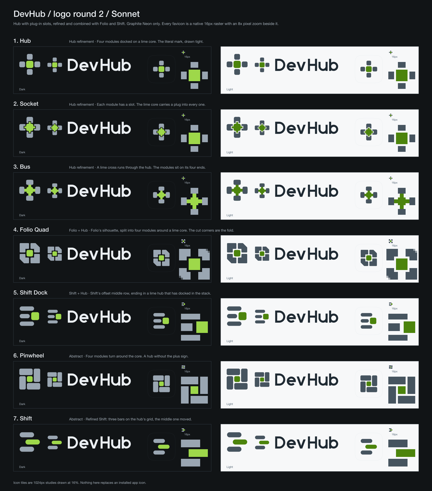

# DevHub logo round 2: Sonnet

Seven marks built from the three things you liked: Astra's Folio, Grok's Shift, and the hub with plug-in slots. Four are hub refinements or hybrids, two are abstract. Hub work leads, as asked.

**Start with [the contact sheet](contact-sheet.png).** Every row shows the mark, a horizontal lockup, a 1024 macOS icon study and the 16px favicon, dark on the left and light on the right. The favicon is shown at native size and again at 8× so you can see every pixel.



Shift Dock is the mark DevHub ships. The installed assets are drawn by `dashboard/scripts/render-brand-icons.mjs`, which adds a softer lime tint on the middle row, a faint lime halo around the hub and a 16px pixel grid. The SVGs in this folder are the original exploration drafts.

## Ranked recommendation

1. **Hub** ([lockup](hub/lockup-dark.svg)). Go with this one. It's the literal version of what you picked: a lime core with four modules docked on its sides. It's also the only one that survives 16px without any compromise: a 6px lime core with four small modules around it reads straight away. It's the safest answer to "does it look like what DevHub does".
2. **Socket** ([lockup](socket/lockup-dark.svg)). The one to pick if you want the "plug-in slots" idea to show. Each module has a slot and the lime core pushes a plug into it. It looks best at app-icon size and in the lockup. The catch: slots and plugs are under a pixel at 16px, so the favicon is just Hub's. That's fine, but it means the detail disappears in a browser tab.
3. **Folio Quad** ([lockup](folio-quad/lockup-dark.svg)). The Folio and hub hybrid. Folio's silhouette is split into four modules around a lime core, and the cut corners at top right and bottom left are the fold. Good silhouette, and it fills an icon tile better than a plus does. It's the least literal of the top three, so it needs the wordmark next to it at first.
4. **Bus** ([lockup](bus/lockup-dark.svg)). A lime cross runs through the hub and the modules sit on the ends. More lime than the others, and a clear favicon. It leans towards a medical plus, which is the risk.
5. **Shift Dock** ([lockup](shift-dock/lockup-dark.svg)). The Shift and hub hybrid. Three rows with the middle one ending in a lime hub that has docked in the stack. Pleasant, but it's the weakest "hub" and reads more as a list or menu.
6. **Shift** ([lockup](shift/lockup-dark.svg)). Your Grok pick, tidied: same idea, bars on the hub's grid. Strong and simple, but the least tied to what DevHub does.
7. **Pinwheel** ([lockup](pinwheel/lockup-dark.svg)). The abstract hub: four modules turning round a lime core. Distinctive, but it looks like a window-manager tile layout. The most "could be any tool".

If you want one decision rather than a ranking: Hub for the product, Socket as the app-icon treatment if you're happy for the favicon to differ. Folio Quad is the one to push if Hub feels too plain.

## Where each one sits

| Mark | Type | Built from |
| --- | --- | --- |
| Hub | Hub refinement | Literal set, top right |
| Socket | Hub refinement | hub-variations, notched modules |
| Bus | Hub refinement | hub-brand-sheet, connector stubs |
| Folio Quad | Folio + Hub | Folio's cut corners on a four-module hub |
| Shift Dock | Shift + Hub | Shift's offset row ending in a lime hub |
| Pinwheel | Abstract | Hub arranged as a pinwheel |
| Shift | Abstract | Grok's Shift on the hub grid |

## Files

Each folder (`hub/`, `socket/`, `bus/`, `folio-quad/`, `shift-dock/`, `pinwheel/`, `shift/`) has an SVG and a PNG for each of these, dark and light:

| Files | Use |
| --- | --- |
| `mark-*` | 64 × 64 standalone mark, transparent. |
| `lockup-*` | Mark plus DevHub wordmark, 354 × 80, transparent. |
| `app-icon-*` | 1024 × 1024 macOS study: an 824px superellipse tile on a transparent canvas. |
| `favicon-*` | Dedicated 16 × 16 artwork, pixel-aligned, transparent. |
| `favicon-*-8x.png` | The native 16px render scaled 8× with nearest-neighbour, for checking pixels. |

"Dark" means artwork for a dark surface, "light" for a light one. The transparent files need the matching background; the contact sheet shows them that way.

## Colour

Graphite Neon only. The two greys are neutral steps I added for the modules; everything else comes from the theme.

| Role | Dark | Light |
| --- | --- | --- |
| Background | `#111416` | `#f7f8f9` |
| Lime | `#9ed84a` | `#4c840c` |
| Wordmark | `#ebeff3` | `#1f2a33` |
| Modules | `#9aa6b2` | `#46545f` |
| Tile border | `#37414b` | `#cfd8df` |

No gradients, glows, raster images or external resources in the SVGs. The modules are deliberately darker (light mode) and dimmer (dark mode) than the wordmark, so the lime is the only bright thing in the mark.

## Notes and caveats

- **Wordmark.** "DevHub" is hand-built from strokes and paths, with no font or text nodes. It's a geometric placeholder so the marks can be compared fairly. If you pick one, the lettering deserves its own pass.
- **16px favicons are separate artwork,** not scaled-down marks, snapped to the pixel grid. Socket reuses Hub's because its slots don't survive. Folio Quad drops the notch detail and keeps the cut corners. I checked each at native size on the contact sheet and in the 8× files.
- **App icon tile** is a superellipse approximation of the macOS shape, not an ICNS or an installed asset.
- **Shift Dock** is deliberately off-centre: the lime hub sits past the bars. That's the idea, but it looks a touch right-heavy in the tile.

## Rebuilding

The geometry lives in `render.mjs`. From the repo root, with Sharp available:

```sh
SHARP_MODULE="$(node -p "require.resolve('sharp', { paths: ['./dashboard'] })")" \
  node docs/brand/logo-explorations/sonnet-round2/render.mjs
```
