# Feature tour

The [README](../../README.md) covers installing DevHub and the main areas: Today, Work, PRs, Notes, Agents and Skills. This page is the rest of it. Each section ends with the guide that has the detail.

DevHub keeps your persona, skills, agents, MCP configuration and notes together as files, in a git repo if you link one. It syncs tool configuration into Claude Code, Codex, Cursor, OpenCode and Antigravity, and agents reach shared notes through MCP. Around that sits a dashboard for the rest of the day: tasks, notes, PRs, repos, a git client, a database client, and agents that can work a ticket from plan to pull request.

It runs on your machine and keeps notes, tasks and configuration in local files. Use a private mirror for personal data. Integrations and model providers receive the requests you send them.

The dashboard recordings on this page use disposable fixture data (`npm run demos:record` and `npm run demos:walkthroughs`). Usage meters and convention rules are seeded examples. The ticket-to-PR flow is a labelled illustration.

## Ticket to PR, with you in the loop

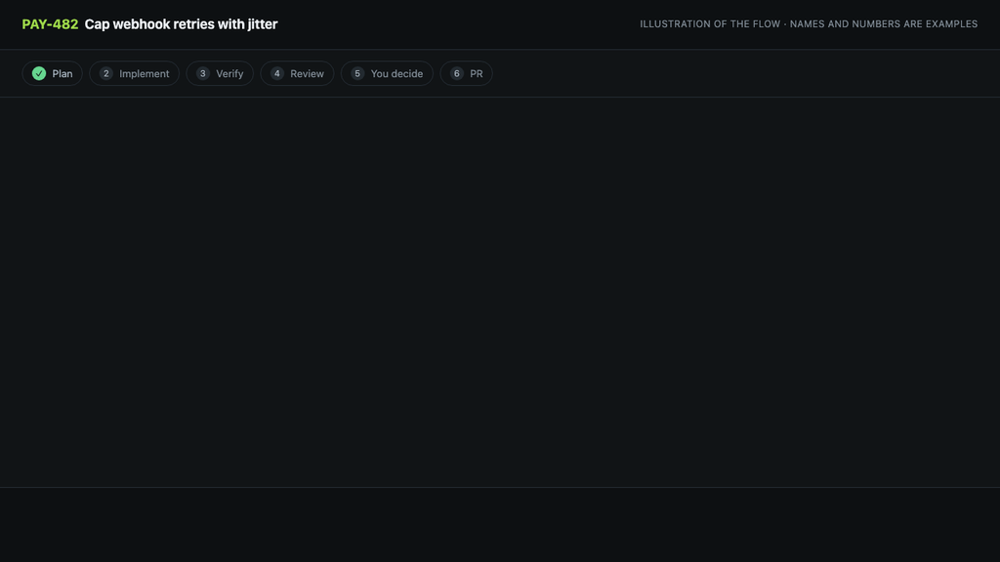

*An illustration of the flow, not a screen capture. The real thing needs a live agent, model access and Cursor, so there's nothing honest to record against demo data. Ticket, file names and numbers are made up.*

The implementation skill guides an agent from ticket to PR. It asks for missing context and requires your approval before commits, pushes and later workflow changes. These are instructions the agent follows, not a built-in approval barrier.

1. **Plan.** A draft task becomes a plan an agent can run without design questions: the change, the files, the commands that prove it worked, and anything only you can answer.
2. **Implement.** *Implement with Agent…* starts the assistant and model you pick (Claude, Codex, Cursor, OpenCode, Copilot) in an isolated worktree on its own branch. It restates the goal and lists its assumptions before it writes code, and it asks if anything would change the approach.
3. **Verify.** It runs the repo's own lint, typecheck and tests. A red baseline means no PR is offered.
4. **Review.** Before it asks to commit, the diff is reviewed against the merge-base: does it fit the ticket, what's the control flow, what's wrong or risky, and what could be deleted. The review is saved as a note linked to the task and the repo. By default the implementing agent does it. Pick **Review with** in the launch sheet (Codex reviewing Claude's work, say) and that assistant does it instead, read-only. The implementing agent then fixes every must-fix finding and records what it did in a `## Resolution` section of the same note.
5. **Read it in Cursor.** DevHub opens the worktree and the review Markdown in Cursor so you can read them together. Edit the review in Cursor and apply it back to the note.
6. **You decide.** The skill tells the agent to ask before commit and push, a draft or ready PR, moving Jira to Code Review, and marking the task done. Starting implementation already authorises moving a linked Jira ticket from New, To Do or Open to In Progress.
7. **After the PR.** DevHub watches it every ten minutes. Failing CI, requested changes and new comments show on the task as **Fix PR with Agent**, and a merge offers to complete it.

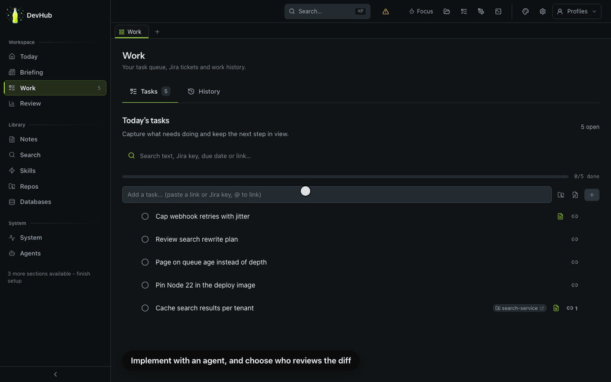

*The launch sheet is real; the assistant catalogue is demo data. This clip chooses a reviewer without starting a run.*

Linked task runs leave a handoff note (branch, last commit, changes against base, session), so any agent can pick up where another stopped. The same loop is driven from MCP if you'd rather not click.

Docs: [Plan loop](plan-loop.md) · [Task agent handoff](task-agent-handoff.md) · [Review with another assistant](task-agent-handoff.md#review-with-another-assistant) · [Agents (Paseo)](paseo-agents.md)

## Tickets become plans

Capture a thought, a Slack message or a Jira ticket as a draft. DevHub attaches what it already knows (related notes, cached PRs, earlier tasks, Datadog alerts from the last day), then **Write plan with Agent…** turns it into a plan. **Mark ready** checks for a plan, acceptance criteria or Jira description, no open questions, a linked repo and no open blockers. You can override gaps with **Mark anyway**.

Going the other way, a planning note becomes linked Jira sub-tasks and DevHub tasks with one skill.

Docs: [Plan loop](plan-loop.md) · [Notes system](../architecture/notes-system.md#create-tasks-from-plan)

## Auto PR reviews

Choose **Off**, **Work hours** or **Always** for PRs that request your review. **Owned repositories only** limits the queue to repos you've marked as owned. Each review starts an agent on your default provider, attempts to refresh that repo's [conventions](#it-learns-from-your-past-prs), and saves the result as a note.

The auto-review flow saves notes without posting a review to GitHub. Drafts are skipped and completed reviews aren't repeated; failed or cancelled runs can retry, up to three attempts. The poller runs at most two reviews at a time while DevHub is running.

Docs: [Auto agent-review](auto-pr-review.md) · [Repo ownership](repo-ownership.md)

## It learns from your past PRs

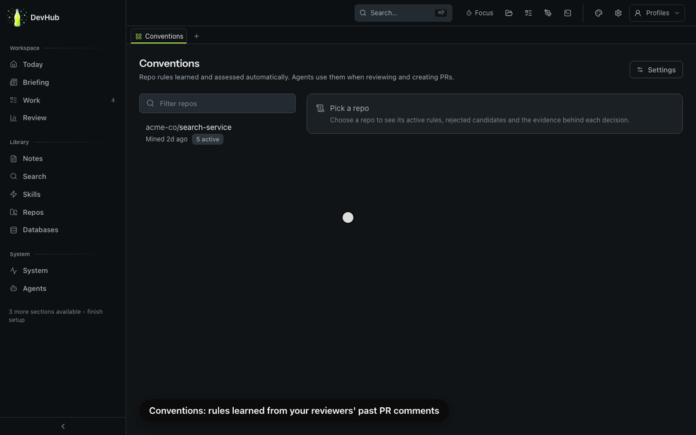

Every repo has rules nobody wrote down. Conventions reads your team's review comments and the repo's own `AGENTS.md`, pulls out the durable rules, and keeps them per repo, each one linked to supporting comments or repo guidance. Reviews check a diff against them, new PRs fix the cheap ones before opening, and implementation follows them while it writes.

No approval queue: a model accepts or rejects each candidate and records why. You can remove or reinstate any rule, and your decision sticks.

Docs: [Repo conventions](repo-conventions.md)

## Notes, in a real editor

A block editor over plain files in git. Daily notes, meetings, projects and learnings, with links between them, tags, and cross-links to tasks, PRs, tickets and repos. Share a note as a secret Gist or a one-time link. Link a note to a repo and open it in Cursor beside the checkout; **Apply Cursor changes** brings your edits back. Optional in-editor AI uses any OpenAI-compatible provider.

Docs: [Notes system](../architecture/notes-system.md) · [Sharing](sharing.md)

## Diagrams

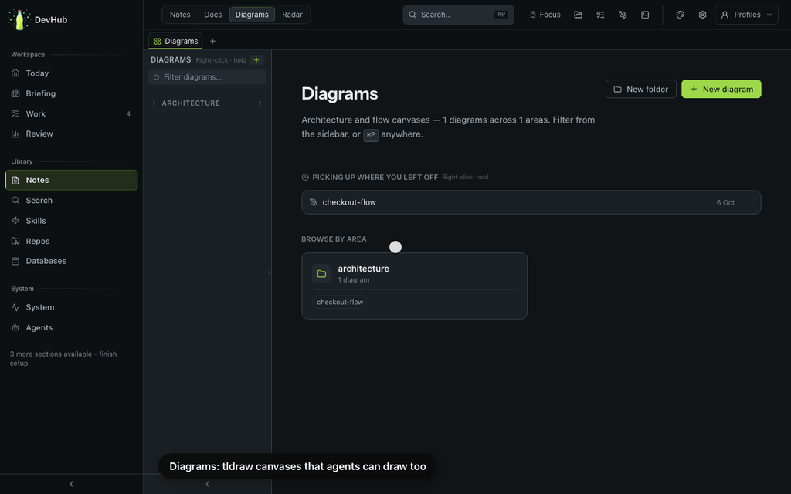

tldraw canvases stored with your notes. Agents can create and edit them through `diagrams_set_graph` and `diagrams_add_shape`.

Docs: [Notes system](../architecture/notes-system.md) · [MCP server](../architecture/mcp-server.md)

## A git client

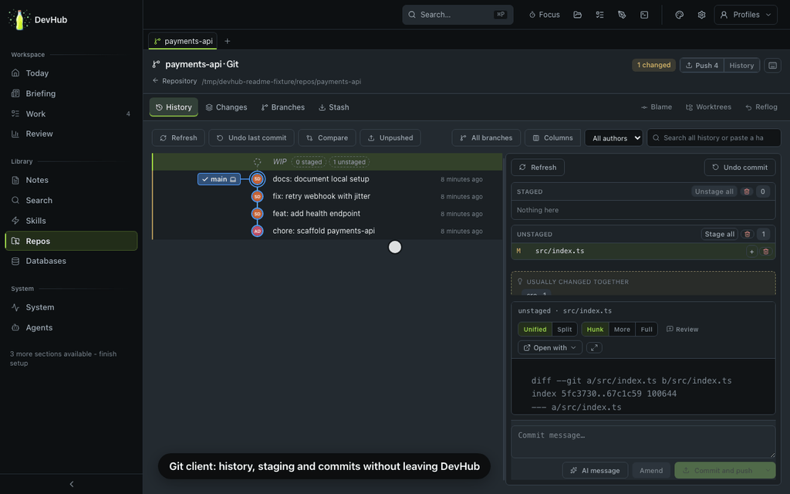

History graph, staging by file, hunk or line, amend, AI-drafted commit messages, branches, stash, blame, reflog and worktrees. There's a three-way conflict resolver, a rebase planner, cherry-pick and revert, and a range compare. Git hook failures show the hook's own output instead of a vague error. Most of these actions are reachable over MCP too.

Docs: [GitHub integration and the git client](../integrations/github.md)

## Databases

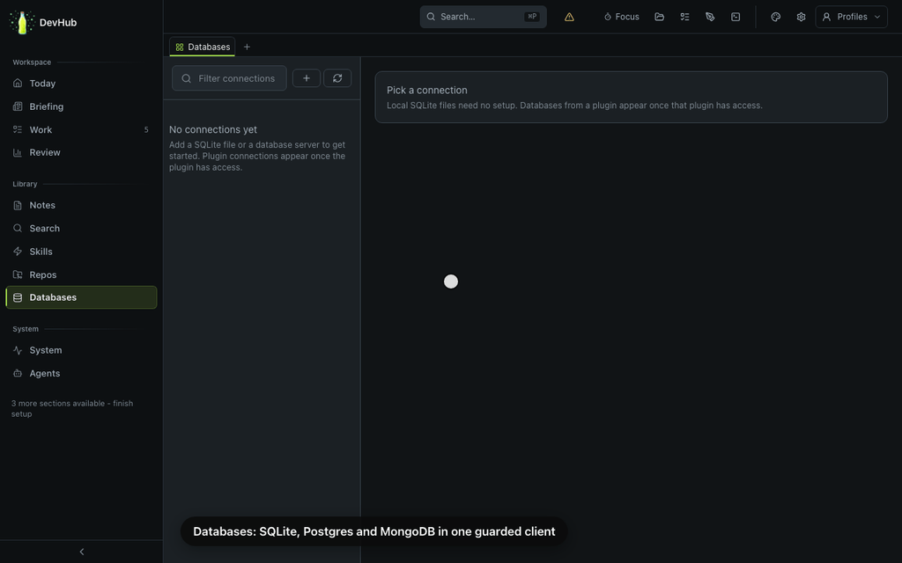

PostgreSQL, MongoDB and SQLite in one client. **Add connection** can discover SQLite files in your repos. Queries pass a statement classifier, with read-only transactions for PostgreSQL and read-only handles for SQLite. MongoDB uses an adapter operation allowlist and rejects write stages in read-only queries; it has no engine-level read-only mode. Writes need write access and confirmation where required.

Edit SQL rows in the grid, diff two schemas, export CSV, JSON or SQL, and ask AI for SQL that passes the same checks before it runs.

Docs: [Database client](../architecture/database-client.md)

## Repos, ownership and one-command start

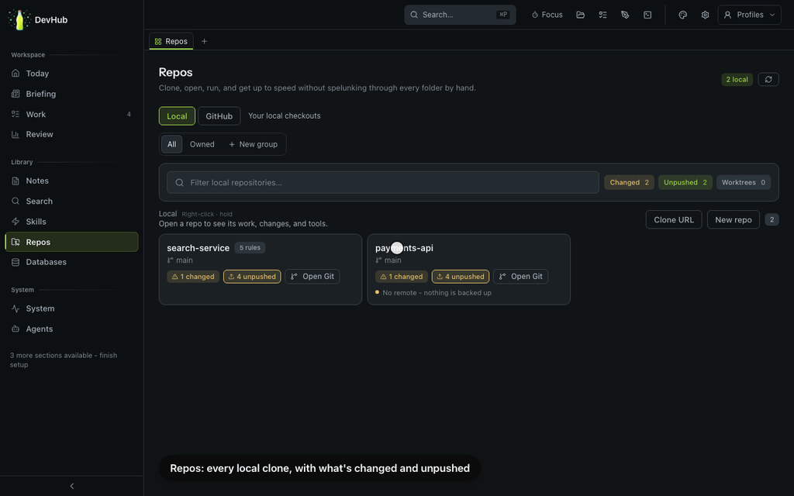

Local clones in your configured scan directory, with what's changed and what's unpushed. Mark the repos you're accountable for and you get an ownership view: inbound PRs by team, branch protection and required checks, knowledge gaps, and a catch-up digest. Finished agent worktrees are listed so you can clear them.

Each repo can have an **upstart**: `upstarts/<repo>/upstart.sh`, a script that gets it running locally in one go (install, env, dev server). **Run upstart** on a repo card starts it. If the repo doesn't have one, an agent writes it, and you approve the exact script before it runs.

Docs: [Repo ownership](repo-ownership.md) · [Repo learning](repo-learning.md)

## One catalogue of skills across your tools

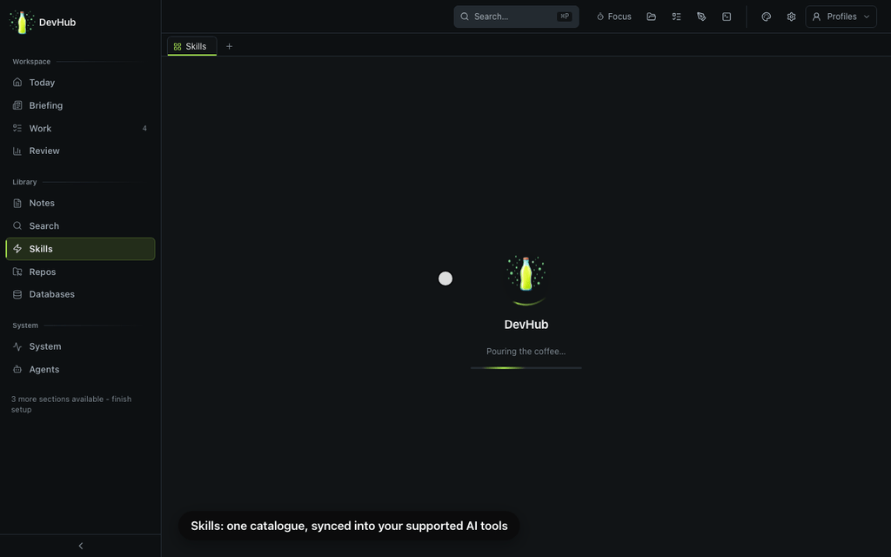

Write a skill once in `skills/shared/` and sync it into Claude Code, Codex, Cursor, OpenCode, Antigravity and the rest. The sync shows what it'll overwrite before it does anything. Skills, agents, the persona and MCP configs all go through the same engine.

Docs: [Skills](skills.md) · [Shared agents](agents.md) · [Sync engine](../architecture/sync-engine.md)

## A voice that sounds like you

The **My voice** quiz gives you twenty scenarios (a Slack disagreement, a chase email, a PR description) and you answer them the way you'd actually write. Your provider distils the answers into the `my-voice` skill and shows you the draft before anything is saved. After that, agents write your tickets, PRs and commits in your voice. Your answers stay in your notes vault, not in the code.

Docs: [Training my-voice](skills.md#training-my-voice)

## Token management

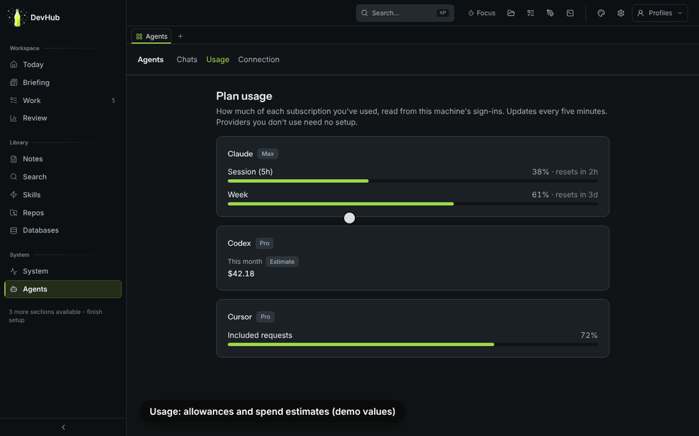

**Usage** shows provider allowances and spend estimates for Claude, Cursor, Codex, Copilot, OpenRouter and z.ai, where sign-in and usage data are available. The persona's always-loaded layers target roughly 650 tokens; actual size depends on your text and the tool. Deeper preferences load on demand. **Recall** ranks notes, docs, tasks and past decisions against a token budget you set, with a score breakdown for each hit.

The usage numbers in the clip are demo values, since the fixture has no sign-ins.

Docs: [Token budget](../architecture/token-budget.md) · [Recall](../architecture/recall.md)

## Every integration, only when you want it

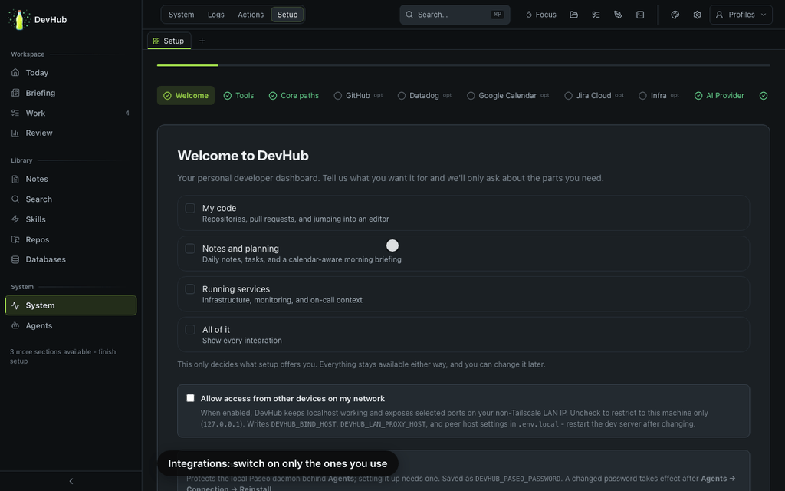

GitHub, Jira, Google Calendar, Datadog and Figma, plus 1Password for secrets. Nothing's required: pages stay hidden until their integration is set up. Google Calendar feeds Today and the morning briefing, and a meeting gets a note in one click.

Docs: [Setup](../getting-started/setup.md) · [Jira](../integrations/jira.md) · [Google Calendar](../integrations/google-calendar.md) · [Datadog](../integrations/datadog.md) · [Figma](../integrations/figma.md)

## A terminal that stays out of the way

A terminal dock under any page. Each command becomes a card with its output, exit code and quick actions, and full-screen apps drop back to a live terminal. Upstart scripts and agent CLI jobs run here, each in its own tab. It's localhost-only and never proxied to the network.

Docs: [Terminal and agent CLI](terminal-and-agent-cli.md)

## Plugins for your own workflows

Company-specific work doesn't belong in the core. A plugin is a separate repo that adds skills, agents, MCP servers, dashboard pages, database connections and branding, and DevHub merges them in on start. Point `/db` at your production databases, add an ops page for your cluster, ship runbooks as skills. The core stays generic, and the plugin stays private to your team.

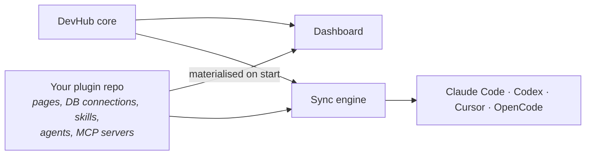

Docs: [Plugin system](../architecture/plugins.md) · [Creating plugins](../contributing/creating-plugins.md)

## MCP tools for agents

The dashboard is for you, MCP is for your agents, and they share the same code. There are 190+ tools across notes, tasks, repos and git, PRs, databases, diagrams, calendar, agents, scheduled jobs and more. Coverage isn't complete; setup, the desktop shell and some UI helpers stay in the dashboard. Run `npm run mcp:inventory` for the current list.

Docs: [MCP server](../architecture/mcp-server.md)

## Reach it from anywhere in the house

Turn on LAN mode and the dashboard opens from your phone or tablet on the same Wi-Fi. Install it as a PWA for a proper icon and a home-screen launch. Away from home, **Pair a phone** reaches your agents through Paseo's end-to-end-encrypted relay instead of exposing anything. The terminal is never proxied, and mutating routes need a same-origin request or a shared secret.

Docs: [LAN access](../getting-started/setup.md#localhost-vs-lan-access) · [PWA](pwa.md) · [Desktop app](../getting-started/desktop-app.md)

## Private by design

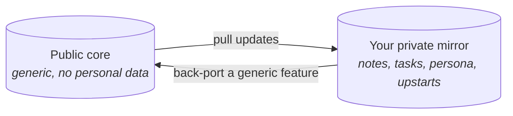

Create a separate private mirror using the fork workflow, and keep notes, tasks, persona, upstart scripts and learned conventions there. Existing mirrors can have unrelated histories; updates and contributions move as content patches. The backport tooling excludes personal-data paths and scans the patch, but you still need to review what you're publishing.

Docs: [Fork workflow](../contributing/fork-workflow.md)

## Honourable mentions

The bits that didn't get their own section but earn their keep.

**Your day**

| | What it does | Docs |
| --- | --- | --- |
| **Themes** | Ember Dusk, Abyss, Graphite Neon, Tokyo Night, Catppuccin and the seasonal Hollow, each in light, dark or system. Plugins can add their own. | [Theming](theming.md) |
| **Focus** | One timer per day. Starting a task stops the last one. | [Dashboard](../architecture/dashboard.md#focus-timer) |
| **Profiles** | Separate task lists for home and work in one repo, switched per machine. | [Task profiles](task-profiles.md) |
| **Capture** | `⇧↵` turns a thought, a Slack message or a Datadog alert into a draft task with related notes, PRs and alerts attached. | [Plan loop](plan-loop.md#1-capture-a-draft) |
| **Briefings** | A morning digest on Today: weather, headlines, local events and what's ready for an agent. | [Dashboard](../architecture/dashboard.md#morning-briefing) |
| **Today layouts** | Rearrange Today's cards on a grid and save presets, or switch to the calmer Focus view. A banner tells you what failed while you were away. | [Dashboard](../architecture/dashboard.md#today-workspace) |
| **Tabs** | Keep a repo, a note and a PR open in workspace tabs, with recent history one click away. | [Dashboard](../architecture/dashboard.md) |
| **Standup** | A Markdown standup from git commits, Jira, PRs, tasks due and your daily note. | [Standup](standup.md) |
| **Weekly review** | The week in numbers, plus a list of tasks that rolled over three days or more. A retro proposes skill edits from what actually landed. | [Dashboard](../architecture/dashboard.md#weekly-review) · [Plan loop](plan-loop.md#8-retro) |
| **Daily review reps** | One AI-free PR review a day, with a streak. Then compare your findings with the agent's and grade yourself. | [Dashboard](../architecture/dashboard.md#daily-review-reps) |
| **1:1 and appraisal** | A 1:1 prep template, and a self-appraisal hub that collects dated evidence through the year. | [Appraisal](appraisal.md) |

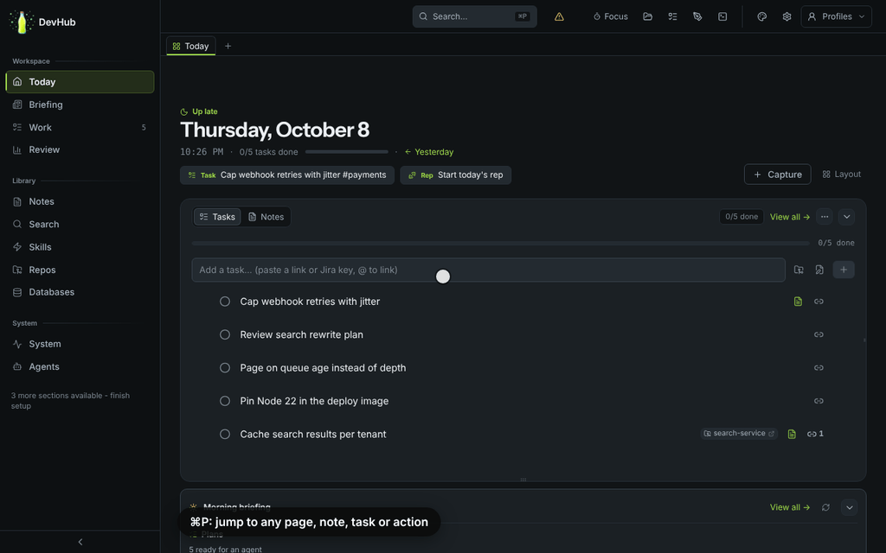

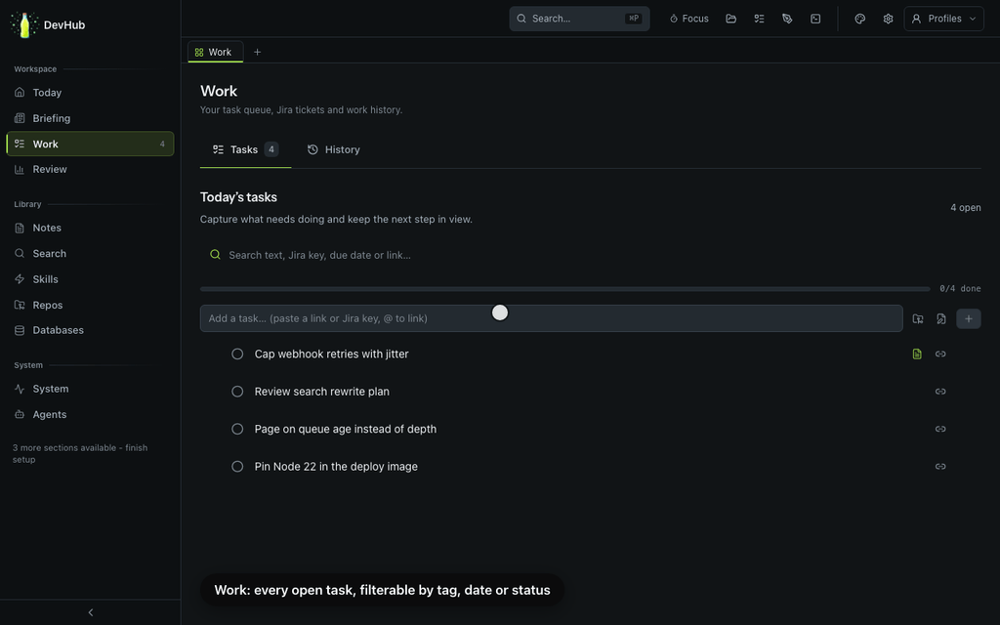

**Knowledge**

| | What it does | Docs |
| --- | --- | --- |
| **Search and ⌘P** | Exact, ranked and semantic search over notes, tasks and docs. The palette (⌘P, or Ctrl+P on Windows and Linux) jumps to any page, note or action, and every repo gets *Ask Agent* and *Terminal here*. | [Command palette](command-palette.md) |
| **Recall** | Hybrid keyword and vector ranking over notes, docs, tasks and an append-only event log, with a graph built from what turns up together. | [Recall](../architecture/recall.md) |
| **Learnings** | Short notes for gotchas worth keeping, recalled in later sessions. | [Notes system](../architecture/notes-system.md#learnings) |
| **Linked checklists** | A master checklist per folder. Tick an item in one note and it's ticked in every note that links it. | [Notes system](../architecture/notes-system.md#master-checklists) |
| **Docs site** | These docs render in-app with contents, backlinks, Mermaid diagrams and full-text search, and you can edit them in place. | [Notes system](../architecture/notes-system.md#content-vaults) |
| **Cross-links** | Tasks, PRs, tickets, meetings, notes and repos link to each other, with a relations panel on each. | [Notes system](../architecture/notes-system.md#cross-entity-linking) |
| **File history** | A history chip on every note and doc, backed by `git log --follow`. | [Notes system](../architecture/notes-system.md#content-vaults) |
| **Live links** | Publish a note or diagram as a secret Gist, or a one-time link that burns after reading. | [Sharing](sharing.md) |
| **Radar** | A personal adopt, trial, assess and hold radar, plus a scan of drift across your repos. "Seen" only comes back if the drift spreads. | [Radar acknowledgements](radar-acknowledgements.md) |
| **Memory providers** | One command to switch between agentmemory, claude-mem or no external memory provider, disabling the other provider as it switches. | [Memory providers](memory-providers.md) |

**Agents and review**

| | What it does | Docs |
| --- | --- | --- |
| **Agent race** | Send one task to two to four assistants, each in its own worktree, then compare the diffs and write up a verdict. | [MCP server](../architecture/mcp-server.md) |
| **Pipeline investigate** | A CI glance on every PR row. *Investigate pipeline* tells a flake from a real failure, reproduces it, and fixes it on a branch. It only pushes when you confirm. | [Pipeline investigate](pipeline-investigate.md) |
| **Datadog** | On-call roster, an alert strip on Today, and an *Investigate* button that starts an agent. New alerts can become draft tasks. | [Datadog](../integrations/datadog.md) |
| **Scheduled jobs** | Run a script or an agent prompt on a cron. Catches up after sleep and can wake the Mac. | [Scheduled jobs](scheduled-jobs.md) |
| **MCP history** | A redacted trace of calls through DevHub's MCP server, with a per-day summary. History reads are excluded. | [MCP server](../architecture/mcp-server.md#trace-what-agents-did) |
| **Specialist agents and skills** | A CI investigator, a reviewer that hunts over-engineering, a second-opinion skill, and fixers for merge conflicts and git hooks. | [Shared agents](agents.md) · [Skills](skills.md) |
| **Project graveyard** | What did you abandon, and why? | [Vendored skills](vendored-skills.md) |
| **Scope-creep detector** | Run before a PR to see what grew beyond the ticket. | [Vendored skills](vendored-skills.md) |
| **Commit archaeologist** | Why does this code exist? Rebuilt from local git history. | [Vendored skills](vendored-skills.md) |
| **Fresh agent CLIs** | DevHub updates the supported agent CLIs daily, once no chat is running. | [Agents (Paseo)](paseo-agents.md#updates) |

**Repos and git**

| | What it does | Docs |
| --- | --- | --- |
| **Worktrees** | Implementation and race runs use isolated worktrees. Finished ones are listed so you can clean up. | [GitHub](../integrations/github.md#finished-worktrees) |
| **Change hints** | The Changes tab nudges you when files that usually change together haven't, and suggests who knows the area, all from the repo's own history. A *why does this exist?* button on a history file launches the commit archaeologist. | [GitHub and git](../integrations/github.md) |
| **Share a patch** | Publish a git patch or a range diff as a 24-hour, burn-after-reading link. | [Sharing](sharing.md) |
| **Repo learning and audits** | Get oriented in an unfamiliar checkout, and run a DX audit for onboarding friction, slow CI and local setup pain. | [Repo learning](repo-learning.md) |

**Platform**

| | What it does | Docs |
| --- | --- | --- |
| **Desktop app** | A native Tauri shell for macOS and Linux, and for Windows through WSL2. A menu-bar or tray icon keeps scheduled jobs running with the window closed. There's a recovery guide for when it won't start. | [Desktop app](../getting-started/desktop-app.md) · [Recovery](desktop-recovery.md) |
| **One-shot ship** | `repo_ship` commits local work, reconciles public-core changes, pushes your private mirror, ports a leak-scanned patch to public, and pushes your plugins. It previews unless you confirm; a confirmed public push goes straight to `main`, without a PR. | [Fork workflow](../contributing/fork-workflow.md) |
| **Safer installs** | The full bootstrap requires Aikido Safe-Chain, and secrets can come from 1Password instead of `.env` files. | [Installation](../getting-started/installation.md) |
| **Calm motion** | Shimmer for content that's arriving, a spinner only for something you just clicked, and one switch (⌘P, *Toggle animations*) that turns it all off. | [Motion](../contributing/motion.md) |
| **Tests** | Unit tests, Playwright journeys and evals for the vendored skills. | [Contributing](../../CONTRIBUTING.md) |
| **A Konami code** | The Konami code loads a hidden Pong game. | |

The three vendored-skill demos below are terminal recordings against a synthetic repo.


## How it fits together

| Directory       | What lives there                                     | Docs                                                    |
| --------------- | ---------------------------------------------------- | ------------------------------------------------------- |
| `persona/`      | Who your agents are and the standards they follow    | [Persona system](../architecture/persona-system.md)   |
| `skills/`       | Reusable workflows, one `SKILL.md` each              | [Skills](skills.md)                         |
| `agents/`       | Shared subagents                                     | [Agents](agents.md)                         |
| `mcp/`          | Which MCP servers each tool gets                     | [MCP server](../architecture/mcp-server.md)           |
| `notes/`        | Notes and learnings, the shared memory               | [Memory](../architecture/memory.md)                   |
| `dashboard/`    | The local Next.js dashboard                          | [Dashboard](../architecture/dashboard.md)             |

Edit any of those, sync, and every tool gets the change, from the dashboard or from the CLI:

```bash
cd dashboard && npx tsx scripts/run-action.ts sync
```

### The learning loop

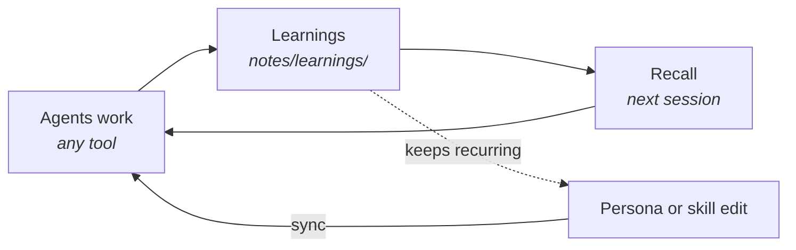

A correction becomes a learning note. One that keeps coming back becomes a persona rule or a skill change. A human decides what becomes a rule. See [Recall](../architecture/recall.md).
