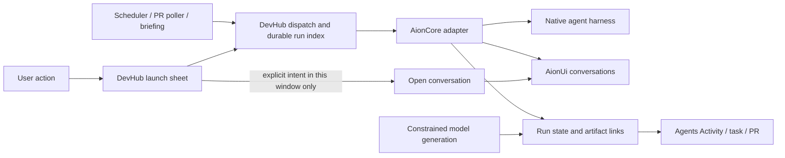

# Agents: one workspace for DevHub AI

Implementation plan · 17 September 2026 · Repository: `devhub-private`

Status: implemented and verified in the checkout. Agents embeds the authenticated, pinned AionUi workspace, routes interactive and background coding work through AionCore, retains generation activity, archives legacy browser chats and removes the custom live chat. Runtime execution was approved and the native compatibility proof passed. The packaged daily-driver application still requires its normal rebuild/restart to pick up the code.

## Decision

Replace DevHub's separate AI destinations with **Agents**, at `/agents`. It is broad enough for code, PR reviews, planning, investigations and briefings. Use AionUi for its conversation browser, composer, streaming output and agent interaction. DevHub continues to own tasks, schedules, PR automation, artifacts and links between them.

Integrate with **AionCore directly through the APIs used by AionUi**. Do not add ACPX between them or build another chat client. AionUi's current frontend uses HTTP and WebSocket calls to AionCore; the runtime routes Claude Code and Codex through direct CLI integrations and uses other routes for ACP agents and Antigravity. The pinned pair has been exercised through both the DevHub API and embedded WebUI. [Frontend adapter](https://github.com/iOfficeAI/AionUi/blob/6744099b279b991c17e31c243f0920477bd31cb6/packages/desktop/src/common/adapter/ipcBridge.ts), [runtime routing](https://github.com/iOfficeAI/AionCore/blob/47e66d0d151123e973b3fd1e77afcb5671b3f8c5/crates/aionui-ai-agent/src/factory/acp.rs).

**Non-negotiable behavior: starting, updating or completing background work cannot navigate a window, select a conversation, open a terminal, focus a composer or disturb a draft.** Only an explicit user action opens its conversation or result.

## Scope and ownership

| Concern | Owner and decision |
| --- | --- |
| Native coding harnesses, their authentication and execution | AionCore and its installed agent integrations. Keep the user's CLI installations and credentials. |
| Conversation contents, search, tool output and interactive approvals | AionUi/AionCore. Reuse the complete client. |
| Task stages, readiness checks, plans, repo/worktree selection | DevHub. Preserve the existing workflows. |
| Schedules, PR polling, deduplication and retry policy | DevHub. Do not create a second set of AionUi schedules. |
| Durable run index and links to tasks, PRs, jobs and artifacts | DevHub, referring to AionCore conversation and turn IDs. |
| Which page/chat a person is viewing | That DevHub window only. Never server-global state. |
| Small, structured AI requests | Use the same activity registry; choose a constrained generation transport as described below. |
| Ordinary shells, upstart scripts and dev servers | Existing terminal dock, including its existing proposal/confirmation rules. |

Remove Chamber, OpenCode, Claude, Cursor, ChatGPT/Codex and Antigravity as separate **AI navigation and launch destinations**. Harness names remain in the agent picker and setup diagnostics. An action such as “Open repository in Cursor” remains an editor action; it is not a competing AI workspace.

**Delete DevHub's custom agent chat implementation as part of this migration.** This includes the chat currently opened by terminal “Send to Agent” actions, its composer/transcript, chat-only dock and popout state, and its dedicated request path. Completion means removing the obsolete implementation and routing callers to Agents, rather than hiding it behind the new navigation. Keep only the small context-handoff and navigation integration needed to reach AionUi.

No lossless conversion of an active Claude session into a Codex session is promised. Changing harness creates a new conversation with an explicit context handoff and a link to the original. Existing native CLI history is not assumed to appear automatically in AionUi.

Grok Bot is a later optional integration. Its absence does not block this migration; choosing a Grok model is not equivalent to running Grok Bot's harness.

## User experience

### One destination

`Agents` has two views:

- **Chats:** the persistent AionUi workspace, with its conversation list, search and rich conversation view.
- **Activity:** DevHub's consolidated list of interactive work, automation and AI generation. Show title, source, agent/model, repo, state, time and result links. Filter by All, Mine, Background and Needs attention, plus repo/task/job. Group small related calls under their parent briefing or operation.

Use a quiet badge for work needing attention. Normal progress updates do not create repeated toasts. A completed background run appears in Activity and on its originating task, PR or briefing. Clicking **Open chat** or **View result** performs the navigation.

Keep the AionUi frame mounted outside `WorkspaceTabPanels`, following the existing persistent service pattern. Each window has one persistent Agents chat surface; switching DevHub pages hides it without recreating it. Activity can unmount normally. Remember local selection, draft and scroll through page switches; verify restart persistence against the chosen AionUi build. Avoid making a full copy of AionUi's sidebar or transcript in DevHub.

Use `/agents?conversation=<id>` for a shareable DevHub conversation link and `/agents?view=activity&run=<id>` for a run link. The adapter converts a conversation link into the verified AionUi web route. Its current renderer uses `/#/conversation/<id>`; do not invent a native `aionui://` conversation deep link. [Router source](https://github.com/iOfficeAI/AionUi/blob/6744099b279b991c17e31c243f0920477bd31cb6/packages/desktop/src/renderer/components/layout/Router.tsx).

### Interactive actions

Keep a small DevHub launch sheet where the action needs DevHub context. It shows the action, target repo/worktree, selected agent and supported model/options, and the context being handed over. Remember the last selection per action stage. Do not ask the user to choose an agent again in AionUi.

| Entry point | Expected flow |
| --- | --- |
| Write plan | Existing task readiness/context gathering → launch sheet → new planning conversation in Agents. The agent writes the plan back to the linked task note. |
| Implement | Existing ready checklist → repo/worktree and agent selection → implementation conversation. Pass the approved plan, acceptance criteria and task link. |
| Resume | Open the linked conversation and continue that harness session where supported. If continuation is unavailable, offer a new conversation with the saved handoff. |
| Manual PR review | PR action → agent choice using the remembered default → review conversation with the exact PR/head and review-note destination. |
| Manual investigation | Preserve the existing investigation context, then open its conversation in Agents. |
| Send terminal context to an agent | Selected output, a command block or the visible screen → new Agents conversation with an unsent draft and the source repo/cwd. The user reviews or adds their question before sending. |
| Free-form work | Agents → New chat using AionUi's own picker and composer. No DevHub wrapper dialog is needed. |
| Continue with another agent | Start a linked conversation with the summary, artifacts and relevant context; retain the original chat. |

A stage change normally creates a new conversation: planning and implementation have different context and permissions. Reopening or continuing the same stage uses its linked conversation. Retrying a failed run is an explicit new attempt, not an invisible repeat of the original request.

After the user submits a launch sheet, open the requested conversation only in the initiating window. If startup is slow and the user has since navigated elsewhere or launched another action, show a ready link instead of redirecting them late. Closing a chat view never cancels execution. Stopping work is an explicit action against the relevant turn.

### Replace the custom terminal chat

Preserve the useful context actions: **Send to Agent**, **Send last block**, **Send screen**, command-block/history actions and repo-specific **Ask Agent**. They all use the same Agents handoff. The default destination is a new conversation; do not infer a destination from whichever chat happens to be selected. An existing conversation can be chosen explicitly, without overwriting its draft or sending into a running turn.

Pass the exact chosen output and its source repo/cwd; include the command and exit status when the selected block provides them. Preserve the selection/block/screen distinction. Do not quietly expand a small selection into the full terminal buffer. Treat captured output as quoted context, never as commands to run. Existing empty-selection handling and normal clipboard/capture behavior remain available.

Prove draft prefill through a supported AionUi interface or a minimal validated embedding bridge in Phase 0. It must stage text without submitting a model request. If upstream cannot accept an unsent draft, use a bounded handoff preview with an explicit **Start chat** action and the selected agent before sending; do not recreate a multi-turn composer in DevHub. Automatic submission on a context-capture click is not an acceptable fallback. Likewise, replace chat-tab drag/drop with an explicit supported handoff; remove the obsolete drop target rather than silently dropping content.

The deletion inventory is:

- `dashboard/components/shell/AgentChatPanel.tsx`: composer, attachment UI, conversation bubbles, streaming/retry/stop state, workflow buttons and command-extraction UI. AionUi owns the ongoing conversation experience.
- `dashboard/lib/agent-chat.ts` and its chat-specific tests: custom chat types, flattened transcript requests, local chat persistence, open/clear/insert/focus events and chat popout preferences. Replace useful behavioral coverage with Agents handoff tests.
- `dashboard/app/api/agent/chat/route.ts`: retire the dedicated custom-chat endpoint after its callers migrate. Shared generation utilities remain for tracked inline AI features.
- `TerminalDock.tsx`: remove agent chat panes, seeds, chat event listeners, agent-only drag/drop routing, provider/status state and chat frame branches. It retains ordinary shells, command blocks/history, capture, terminal proposals and terminal frame controls.
- `AgentStatusStrip.tsx`, `agent-attach.ts`, chat-only helpers in `terminal-prompt.ts`/`agent-status.ts`, and agent-specific portions of `terminal-agent.css`: remove once caller checks prove them unused. The stylesheet and helpers may contain shared terminal behavior; move or retain those portions rather than deleting by filename alone.
- Command-palette and other AI callers: replace `openAgentChat`, `focusAgentComposer` and `insertAgentComposer` with explicit Agents navigation/context handoffs; remove delayed focus timers and custom chat tabs. Shared terminal window controls such as `DockFrameControls.tsx` remain where ordinary terminals use them.

Before deleting the persistence reader, migrate/export legacy `devhub:agent-chat.v1` history from each browser/webview's local storage, including any saved unsent text. A server cannot read that storage on its own. Make migration versioned and repeatable, verify the archived result, and leave original data recoverable if migration fails. Use an existing generic artifact/archive view for old transcripts; retaining the custom live chat panel as an archive viewer would defeat this removal. Remove obsolete chat preference keys only after their replacement or archive is verified.

### Background actions

Automatic PR reviews, scheduled jobs, background pipeline investigations and briefings create their own runs without opening a UI. A new scheduled occurrence gets a separate conversation or generation record; it never sends into the chat currently selected by the user.

Use the existing PR eligibility, head-change, deduplication and retry rules. Reviews keep their current artifact behavior: writing a review note does not automatically post a GitHub review. Explicit user requests to publish remain a separate action.

Permission requests change the run to **Needs attention**. They may show a badge and the existing appropriate notification, but cannot bring a window forward. Opening the run reveals the approval in AionUi. Do not enable blanket approval to make background work convenient.

## Architecture

Extend `dashboard/lib/agent-runs` as the single dispatch/lifecycle boundary. Add a small `dashboard/lib/aionui` adapter for connection, validated request/response mapping, catalog capabilities and events. Keep upstream schemas and naming inside that adapter. `agent-job.ts` becomes a UI caller of the shared dispatch service and a separate, client-only navigation helper.

Do not add a generic agent framework, a second scheduler, another transcript database or a new public orchestration API. Preserve the existing DevHub agent APIs and MCP tools while changing their execution backend.

### Connection and hosting

1. Add one setup panel for the AionUi connection, detected version, agent readiness and a test connection action. Agent/model choices come from the runtime catalog and advertised capabilities, not a hard-coded replacement list.
2. Initially attach to one configured AionCore/AionUi instance. The DevHub server and embedded UI must use the same user identity and history store. Detect and reject accidental attachment to a different instance.
3. Use the full WebUI in the persistent Agents surface. Verify the actual served HTML, authentication, cookies, CSP, WebSocket upgrades, file interaction and desktop webview behavior before selecting iframe hosting. The upstream web host serves the renderer and forwards its API/WebSocket traffic to AionCore. [Web host source](https://github.com/iOfficeAI/AionUi/blob/6744099b279b991c17e31c243f0920477bd31cb6/packages/web-host/src/static-server.ts).
4. If a small documented embedding/selection bridge is needed, keep it as a narrowly scoped upstream contribution or pinned patch. Validate message origin and window source. Do not extract the renderer into DevHub or strip arbitrary security headers to force embedding.
5. If embedding cannot be made reliable within the compatibility proof, record that failure before cutover. Opening the rich WebUI in a separate browser is a usable pilot fallback, but does not satisfy the final embedded-workspace acceptance criterion by itself.
6. Add DevHub-managed startup only after attachment works. Reuse the existing peer-service and desktop supervisor infrastructure, with explicit ownership and version checks. Manage one runtime/store; never start a second backend against an open database. Stop only processes DevHub owns, and do not stop active runs when the Agents page closes.
7. Keep managed services local by default. Store connection secrets server-side using existing secret/config patterns. Never put runtime credentials in URLs, prompts, notes or browser-visible settings. Validate local API inputs, origins, configured targets and workspace roots.
8. Pin a tested AionUi/AionCore pair and contract-test upgrades. Do not silently follow `main`. A newer independently built AionCore is not presumed compatible with a released AionUi.

Background work requires the configured DevHub and Aion services to be running, but no browser or visible desktop window. Preserve the current desktop background/wake behavior; do not claim jobs run after every supporting process has been quit.

### Conversation operations

The initial adapter needs catalog/health, create/list/get conversations, send a message, get messages/runtime state, receive events, continue a conversation and cancel a specific turn. Interactive confirmations remain in AionUi; DevHub observes their state and links to them. The upstream routes provide these conversation operations. [Conversation routes](https://github.com/iOfficeAI/AionCore/blob/47e66d0d151123e973b3fd1e77afcb5671b3f8c5/crates/aionui-conversation/src/routes.rs).

Use catalog agent IDs and agent-specific configuration. A model API configuration object is not interchangeable with a native harness's model setting. The compatibility proof must establish the exact request payload for each required harness, including cwd, assistant/profile, model, skills and MCP servers.

Treat an accepted message as **submitted**, not complete. Record its returned conversation/message/turn identifiers. Reconcile completion and waiting states from events plus current runtime/message snapshots. AionCore distinguishes runtime state, active turn and pending confirmations; DevHub must preserve that distinction. [Runtime/conversation types](https://github.com/iOfficeAI/AionCore/blob/47e66d0d151123e973b3fd1e77afcb5671b3f8c5/crates/aionui-api-types/src/conversation.rs).

The source exposes HTTP/WS implementation contracts, not a guaranteed stable embeddable SDK. Phase 0 must prove the installed build, including normal client authentication. Do not use credentials injected into an already-running agent as DevHub's integration identity.

### Durable records

Extend the existing run model with a versioned runtime discriminator: `aionui`, `generation`, or `legacy-cli`. Generation covers both constrained API requests and CLI print mode; neither implies a resumable coding conversation. Binary, PID and terminal proposal fields belong only to legacy execution; generation may observe its owner process for recovery but must never signal it. Preserve existing run IDs and API compatibility where possible; update validators and consumers together where the state model changes.

| Record | Required information |
| --- | --- |
| Run identity | Run ID, attempt/idempotency key, origin/action, creation/update timestamps, parent/group ID when applicable. |
| Context | Task ID/date, repo, cwd/worktree/base SHA, PR URL and reviewed head SHA, job ID and scheduled occurrence, relevant note/artifact references. |
| Execution | Runtime/connection ID, agent ID, model/options, conversation ID, message/turn IDs, optional native harness session ID. |
| State | Queued, starting, running, needs attention, completed, succeeded, failed or cancelled; connectivity tracked separately. |
| Result | Result summary, artifact references, error category/message, usage/cost when reported; unknown usage stays unknown. |

A conversation persists across multiple turns and runs. Completing a turn does not automatically mark a task implemented, a PR approved or an artifact saved. Keep the existing task-stage and artifact checks authoritative.

Also index conversations and turns created directly in AionUi, using its events and conversation listing for reconciliation. Label their source as AionUi and leave task/PR associations empty unless explicitly linked. This makes free-form work visible in Activity without requiring every chat to start through a DevHub dialog.

Move new run records from the temporary directory to a versioned store under `notes/.config/agent-runs/`, using the repo's existing file-storage patterns and atomic updates. Keep durable metadata and result links until explicitly archived/deleted. AionCore owns full managed transcripts; DevHub need not duplicate them. Any disposable event cache must be separable from durable history.

The existing store prunes finished runs after three days. Migrate still-available legacy metadata and relevant results before that pruning can affect them; already-expired data cannot be reconstructed. Keep task sidecars under their existing paths and add conversation/run links. Preserve task rollover/relinking and the existing handoff snapshots.

If a conversation is deleted or unavailable upstream, keep the DevHub record and artifact links with an explanatory state. Do not recreate it or replay its prompt automatically.

### Backend execution and recovery

- Dispatch runs on the server, independently of the terminal dock or an open page. Backend subscriptions and recovery polling must not use visibility-paused UI hooks.
- Keep existing cwd validation, agent availability checks, depth limits, consent, budgets, concurrency caps and worktree behavior. Implementations retain isolated worktrees by default; reviews and briefings get appropriately constrained profiles.
- If a harness cannot enforce a required execution limit or permission profile, mark it unavailable for that constrained action. Do not silently discard the restriction while retaining its label in the launch sheet.
- Serialize conflicting operations on the same conversation and prevent competing writers in the same checkout. Do not silently reuse a running conversation for unrelated work. Preserve requested parent/worktree inheritance for deliberate follow-ups.
- Persist a dispatch intent before upstream creation/send. Use upstream idempotency if verified; otherwise correlate the durable intent with upstream IDs/metadata and reconcile ambiguous outcomes. Never blindly retry a message POST after a timeout, since it may already be executing.
- Claim scheduled occurrences and PR/head review attempts atomically across the packaged app and a development server. A process-local flag or an ordinary read-then-write of `lastFiredFor` is insufficient for duplicate prevention.
- After reconnect/restart, fetch current runtime state and messages to repair missed events. Deduplicate event handling and ignore stale updates. A disconnected stream means “Reconnecting,” not “Failed.” If acceptance cannot be determined safely, expose an unresolved dispatch for inspection rather than replaying it.
- Cancellation targets the tracked turn. Confirm cancellation from runtime state; do not mark work stopped merely because a local HTTP request was aborted. Preserve the conversation and artifacts.
- Separate legacy PID/proposal reconciliation from AionUi runs. Missing shell PIDs and terminal proposal expiry must never fail a new managed run.

### Enforcing the navigation boundary

Separate `start/continue/cancel work` from `open conversation`. Dispatch APIs return run/conversation links and emit activity updates; they do not emit navigation events. The UI applies an explicit open intent only in its originating window and only while that intent is still current.

This must cover indirect navigation too. Background agents can currently reach `ui_open` and note-opening tools, which publish through `/api/desktop/navigation`. Carry a trusted run origin/presentation policy through nested dispatch and run-scoped MCP connections. Exclude or reject navigation tools for unattended runs at the server boundary, and return artifact links instead. A prompt saying “don't steal focus” is insufficient.

Do not broadcast active conversation selection through local storage, server events or shared AionUi client settings. Verify AionUi itself does not auto-select a newly created background conversation. If it does, correcting that behavior is a cutover prerequisite.

For conversation links, workspace-tab matching must include the conversation ID; the current navigation handler's path-only comparison would treat different `/agents?...` conversations as identical. Explicit links may select the requested chat in the window's existing Agents surface. Other windows remain unchanged.

## Bring all AI activity into view

Include this in the project, with a clear distinction between a managed conversation and a generation result.

1. Register every server-side AI call with the shared run lifecycle, including errors and cancellation. Propagate a parent/group ID for multi-call operations. Cache hits are labeled as cached results and do not fabricate a new model invocation.
2. Move briefing summaries, tips and similar bounded text jobs through AionUi when the selected runtime can enforce a text-only/no-tools profile and meet the existing output/timeout requirements. Create a separate background conversation per briefing occurrence and link it from the briefing.
3. If that restriction is not enforceable for a provider, retain the direct model generation transport and record its input summary, output/artifact, model, state and usage in Agents Activity. Do not substitute a tool-enabled coding agent just to obtain a chat entry. Label these **AI generation**, with **View result** and optional **Continue in chat**. The latter creates a new conversation explicitly.
4. Instrument direct SDK callers as well as `generateAiText`; otherwise the claim of complete visibility would be false. Preserve structured output validation, streaming, image support, abort signals, timeouts, caching and current UI fallback behavior. A consumer may use its existing fallback while Activity still records the generation failure.
5. Group small calls so a briefing or repo-learning refresh is one readable Activity item with child calls, rather than dozens of sidebar conversations. Never include provider secrets or unrelated sensitive data in activity summaries.

Coverage includes briefings and canvas/design generation, task extraction, notes AI, capability enrichment/explanations/tutors, repo learning/tutors and ownership digests, commit/stash messages and SQL generation. SQL remains generated text subject to the existing read-only validation and user execution flow; this migration grants no new database execution permission.

## Code map

Paths below are implementation targets, not files changed by this plan. Re-check the current working tree before editing. Check `git ls-files -- <path>` for each dashboard target; materialized plugin files must be changed in their plugin source repository.

| Area | Existing entry points and intended change |
| --- | --- |
| Navigation and hosting | `dashboard/lib/nav.ts`, `dashboard/app/layout.tsx`, `components/persistent/PersistentOpenCode.tsx`, `PersistentChamber.tsx`, `PersistentServiceFrame.tsx`; add `/agents` and a persistent AionUi host. Remove the session-created → route-push coupling. |
| Shell entry points | `components/shell/WorkspaceTabs.tsx`, `CommandPalette.tsx`, `TerminalDock.tsx`; top bar, launch menu, shortcuts, mobile shelf and tab-title helpers. Replace AI open/focus events while preserving ordinary terminal behavior. |
| Custom chat removal | `components/shell/AgentChatPanel.tsx`, `AgentStatusStrip.tsx`, chat portions of `terminal-agent.css`, `dashboard/lib/agent-chat.ts`, `agent-chat.test.ts`, `agent-attach.ts`, and `app/api/agent/chat/route.ts`; delete the obsolete chat stack after migration and reference checks. Rewire `TerminalBlockHistory.tsx` and `TerminalBlocksView.tsx` context actions through the new handoff. |
| Interactive launch | `dashboard/lib/agent-job.ts`, `agent-chat.ts`, `components/tasks/useTaskAgentActions.tsx`, `PlanTaskDialog.tsx`, `ImplementTaskDialog.tsx`, `ImplementReadyPanel.tsx`; use one shared launch result and explicit local open action. |
| Runtime/lifecycle | `dashboard/lib/agent-runs/dispatch.ts`, `background.ts`, `run-files.ts`, `store.ts`, existing events/consent/budget/worktree modules; add the AionUi adapter and runtime-specific reconciliation. |
| APIs and task linkage | `dashboard/app/api/agent/**`, `app/api/tasks/agent-runs/**`, `app/api/tasks/implement/**`, `app/api/tasks/stage/route.ts`, `dashboard/lib/tasks/task-agent-runs.ts`, `reconcile-task-agent-sidecar.ts`, `run-snapshot.ts`; preserve stage checks and handoff/resume contracts. |
| PRs and investigations | `dashboard/lib/github/auto-pr-review.ts`, `auto-pr-review-poller.ts`, `auto-pr-review-state.ts`, `pipeline-investigate.ts`, relevant PR/pipeline/Datadog routes and buttons; dispatch silently for background origin and link results. |
| Scheduler | `dashboard/lib/scheduler.ts`; server-owned execution, atomic occurrence claim, durable status/recovery and current wake/approval policy. |
| MCP | `mcp-servers/devhub-server/src/tools/agents.ts`, `tasks.ts`, `work.ts`, `jobs.ts`, `ui.ts`, `notes.ts`, `datadog.ts`, annotations and dashboard client context; preserve dispatch/wait/follow-up/cancel/diff contracts and enforce unattended navigation policy. |
| Activity | `dashboard/app/agent-activity/client.tsx` and its APIs; reuse under Agents Activity, with source grouping, durable links and managed-generation records. |
| Shared AI generation | `dashboard/lib/ai/generate.ts`, `briefing-ai.ts`, `briefing-canvas.ts`, `repos/learn-ai.ts`, `db/ai-sql.ts`, briefing design route; register all calls and add constrained conversation-backed briefing support. |
| Direct SDK bypasses | `dashboard/lib/briefing-tasks.ts`, `capability/ai-enrich.ts`, `capability/explain.ts`, `ownership/service.ts`, `notes-ai/stream-chat.ts`, commit/stash-message routes, capability journey and repo-learning tutor routes; move through the shared tracked boundary without losing feature-specific response contracts. |
| Service/setup cleanup | `dashboard/lib/dev-peer-services.ts`, `dev-services.ts`, `peer-service-availability.ts`, setup and status/service routes, `desktop/sidecar/supervisor.mjs`, desktop staging/config and root install/start scripts; add a single AionUi connection and remove obsolete peer launch/theme logic after cutover. |
| Documentation/config | Task handoff, agents, auto-review, pipeline, scheduled jobs, setup, environment variables and companion guides; update affected shared skill/MCP descriptions and persisted navigation/provider defaults. |

## Delivery plan

Each delivery should be a reviewable change. Keep compatibility experiments and active runtime changes separate from deleting the old UI. Avoid combining user-owned in-progress edits into an unrelated rewrite.

### 0. Prove the integration before committing to cutover

Pin and record a release plus the exact paired AionCore version. Research found AionUi `v2.2.2` as the latest non-prerelease release on 17 September; that is a candidate, not an assertion of tested compatibility. The source links in this plan reference AionUi commit `6744099b` and AionCore commit `0268ceb0`, which are not assumed to be a release pair. [Release](https://github.com/iOfficeAI/AionUi/releases/tag/v2.2.2).

Build a disposable, read-only integration probe with synthetic prompts and its own conversation namespace. Do not touch the user's existing sessions. Produce a capability table for **Claude Code, Codex, OpenCode, Cursor and Antigravity** covering launch, model selection, working directory, native authentication, streamed output, tool approvals, cancellation, continuation after restart, history and relevant MCP/skills support. Mark unsupported capabilities explicitly; never silently route a requested harness to another one.

Prove authenticated create/send/status/history from the DevHub server without an open browser, plus exact-chat opening in the embedded client. With chat A selected and an unsent draft, create/run chat B from the server; A must retain selection, draft, scroll and focus. Repeat with two DevHub windows and after reconnect. Check whether sessions created outside AionUi can be listed/imported/resumed, separately from sessions AionUi created.

Also prove terminal-context handoff: preserve the selected text and cwd, create an unsent draft without an AI request, and keep unrelated conversation drafts intact. Record whether this uses supported draft prefill or the explicit handoff-preview fallback described above.

Exit evidence: tested request/response fixtures, chosen version pair and connection mode, embedding/auth result, supported harness matrix, and a written history-migration capability report. If a required harness or reliable embedding is unsupported, specify the bounded adapter/upstream work before scheduling removal of its current path. Do not declare migration complete on the strength of the README.

### 1. Build the backend and durable run records

Implement the adapter, catalog capabilities, version/health checks, versioned run store, source metadata, runtime state reconciliation and existing API/MCP compatibility. Replace terminal-dependent dispatch for opted-in AionUi runs. Preserve legacy reads and let active legacy work finish.

Include idempotent dispatch recovery, atomic background claims, targeted cancellation and unattended MCP/navigation restrictions here. Test them without mounting a frontend. This delivery is usable behind an internal migration flag before any navigation removal.

### 2. Add Agents and move interactive handoffs

Add the persistent client, Activity view, launch sheet integration, local navigation intents and task/PR/result links. Migrate write-plan, implementation, resume, manual review, investigation, free-form AI and every terminal-context handoff entry point. Deliver the custom-chat deletion inventory above once the replacement behaviors pass, including client-side history migration. This is an implementation removal, not merely disabling the old window. Phase 5 handles the remaining companion and global navigation cleanup.

Exercise real conversations in the supported primary harnesses. Verify readiness checks, the plan-to-implementation context handoff, repository/worktree correctness, approval handling and artifact return. Preserve ordinary terminal tests and behavior.

### 3. Move automation and verify it stays quiet

Migrate automatic PR reviews, scheduler agent jobs and background investigations to the same backend. Keep existing enablement, schedules, approval policies, deduplication and notes outputs. Add needs-attention and completion links without navigation.

Observe a scheduled occurrence and automatic review with no UI connected, then reconnect and inspect their history. Run the focus regression matrix below before enabling by default.

### 4. Cover briefings and every remaining AI call

Instrument the shared generation wrapper and all direct SDK callers. Introduce the constrained briefing profile for harnesses that passed the capability proof; use clearly labeled generation records otherwise. Group related calls, preserve structured/streaming behavior and link results back to their source screens.

Exit with an audited inventory: every production AI invocation crosses the shared activity boundary, or is an explicitly documented external integration beyond DevHub's control. No untracked fallback or hidden print-mode CLI remains.

### 5. Migrate history and remove obsolete launch paths

Switch the main navigation to the single Agents entry. Fold Agent Activity into its Activity view. Migrate persisted tabs, command-palette entries, keyboard shortcuts, top-bar/mobile launchers and relevant setup defaults. Provider-specific agent/model choices move to capability-backed stage preferences.

Redirect old `/chamber`, `/opencode`, `/claude`, `/cursor`, `/chatgpt`, `/antigravity` and `/agent-activity` UI routes to an appropriate Agents view. For old session links, preserve the legacy identifier and show the matching archive/import status; do not pretend it is an AionCore conversation ID. Retire old APIs with a clear compatibility response or adapter where callers remain—never turn a stale request into a surprise terminal launch.

Import available DevHub run metadata and dock-chat history. Use verified upstream import/export facilities for native history where available. Otherwise preserve the source data and present supported archived transcripts as read-only, with an explicit “Continue in new chat” handoff. Report any history that cannot be displayed. Do not build a universal live native-history synchronization engine in this project.

Remove unused Chamber/OpenCode companion startup, theme injection, action routes, AI-specific terminal wiring, obsolete preferences and dependencies after reference checks. Keep native CLIs and their authentication/skills/data, and keep generic terminal/editor functionality. Update docs and shared tool/skill descriptions. No history or installed application is deleted as a side effect.

During rollout, the migration flag permits an explicit rollback for new work while existing managed runs and history remain accessible. Do not redispatch active work on rollback. Remove temporary dual-launch UI once acceptance passes; no permanent second picker or silent terminal fallback remains.

## Verification and acceptance

Add focused tests to the existing suites plus adapter contract fixtures; do not write broad snapshot tests of upstream UI. Run root `npm run lint`, `npm run typecheck` and `npm run test` for relevant deliveries, then `npm run verify` before final handoff. Include the desktop supervisor/staging checks when those files change.

Use the `devhub-dashboard-verify` workflow for rendered UI checks on a free-port checkout development server. Port 1337 is the packaged daily driver and cannot validate checkout edits. Capture screenshots or a short recording of the interactive and background flows; review focus, layout, loading, errors, empty states, keyboard access and mobile layout. Use existing UI primitives, content skeletons and motion rules.

| Test | Observable pass condition |
| --- | --- |
| Interactive launch | Plan, implement and manual review open the correct rich conversation in the initiating window; no terminal tab appears. |
| Terminal context handoff | Selection, last block, visible screen and block-history actions carry only the requested context plus source metadata into Agents. Capture alone sends no model request and overwrites no existing draft. Empty input remains a useful error. |
| Custom chat retirement | After cutover, no live caller uses the old chat events or `/api/agent/chat`; the custom composer/transcript/popout implementation is deleted. Legacy local history is archived/exportable, and ordinary shell sessions, command blocks, capture and terminal proposals still work. |
| Late launch response | Navigate away while a launch starts; its later response does not redirect or focus anything. A link remains available. |
| Chat A/background B | While typing in A, launch and complete B automatically. A's selection, draft, scroll and keyboard focus are unchanged. B is visible in history/activity. |
| Other page/window | Launch B while reading a note, while Agents is hidden, and with two windows open. No tab, route or window activation changes. |
| Indirect navigation | An unattended run or child attempts `ui_open`/note-open. The server blocks navigation and records/returns the result link. |
| Browser closed | A due job executes without a browser/dock listener. Reopening DevHub shows its actual state and conversation/result. |
| Duplicate prevention | Concurrent production/dev scheduler ticks and retried HTTP requests produce one accepted occurrence/attempt, including ambiguous network failure. |
| Lifecycle recovery | Restart DevHub or disconnect events mid-turn. Reconciliation recovers without duplicate prompts or false success/failure. |
| Permissions | A blocked tool call shows Needs attention; no blanket approval, popup or focus change occurs. Opening the run permits normal AionUi interaction. |
| Cancellation | Stop only the chosen turn. Other conversations continue; the cancelled chat and partial artifacts remain available. |
| Task continuity | Plan→implementation carries the approved context; same-harness resume uses supported continuation; cross-harness continuation creates a linked new chat. Task rollover preserves links. |
| Artifact semantics | Turn completion alone cannot approve a PR or mark implementation complete. Expected note/artifact/stage checks still apply. |
| Provider fidelity | Each selectable harness really executes that harness with the correct cwd/model/authentication and supported context. Unsupported choices explain the missing capability. |
| Durable history | Records and links survive restart and more than three days. Missing upstream conversations show useful archived metadata, not an empty/crashed view. |
| AI coverage | Briefing, notes, tutor, capability, commit-message and SQL calls are recorded with correct success/failure/cancellation and parent grouping; response contracts remain intact. |
| Generation constraints | A briefing/text-only job cannot gain shell/file/DB permissions through its new transport. Direct-generation fallback is identified honestly. |
| Cleanup | One Agents AI destination remains across desktop/browser/mobile navigation and shortcuts; stale routes do not start old services. Ordinary terminals and editor actions still work. |

## Open questions and limits

No product decision needs to block the first delivery: use **Agents**, keep DevHub's launch sheet where it supplies task context, reuse AionUi's full client, and preserve DevHub scheduling.

Compatibility evidence and limits are recorded below. Native CLI history outside AionUi remains outside its store. Generation stays on its constrained transport and is indexed in Activity.

This plan does not include normal Claude/ChatGPT web-app conversation import, lossless cross-harness runtime migration, universal synchronization of chats created in unrelated applications, Grok Bot integration, or rebuilding AionUi inside DevHub. It does include durable visibility for every AI action DevHub launches.

## Implemented compatibility decisions

- Pinned AionUi 2.2.2 (6744099b279b991c17e31c243f0920477bd31cb6) with AionCore 0.2.2 (47e66d0d151123e973b3fd1e77afcb5671b3f8c5). All five required native harnesses returned synthetic test responses: Claude Code, Codex, OpenCode, Cursor and Antigravity. This verifies invocation and existing authentication, not every native model or tool capability.
- Managed setup currently supports Apple silicon macOS. It installs under ~/.local/share/devhub/aionui, uses launchd on loopback ports 25818/25819, and saves the authenticated connection privately under ~/.config/devhub. Ordinary CLI installs and auth remain intact. The supporting processes persist when a page or DevHub window closes. Existing WebUI attachment is available separately.
- DevHub uses normal authenticated WebUI cookies and CSRF headers. The upstream convenience launcher uses unauthenticated --local mode; DevHub rejects that mode. A user and marker conversation pin the history store before writes. No credential appears in prompts or browser-visible JSON.
- AionUi owns the full conversation list, composer, permissions and transcripts. DevHub uses its supported conversation URL; there is no draft-injection bridge. Terminal capture opens the approved bounded preview and requires Start chat.
- Runtime message completion does not identify every native terminal reason. Finished output is recorded as completed, presented as Finished, and never treated as verified task success. Task stages and artifacts remain authoritative. Native max-turn overrides are rejected when unsupported; usage and cost remain unknown unless actually reported.
- HTTP writes are not retried. Durable request claims reserve work before submission, including scheduler occurrence and PR revision/attempt keys. Interrupted acknowledgement becomes Needs attention and requires inspection; it is never silently resent. Reconciliation reads the exact submitted message/turn.
- DevHub generation uses the same activity registry and retains its existing bounded SDK/CLI-print behavior. It is grouped in Activity rather than copied into invented coding chats.
- Browser-side legacy exports retain originals and verify archived content before marking migration complete. Each browser must visit the updated DevHub once to archive its own local history. Archive downloads preserve exact stored data.
- Live proof: duplicate submissions returned one run; follow-up reused the conversation; exact-turn cancellation reached cancelled; a headless background start preserved the visible composer draft and focus. Switching Activity/Chats preserved the draft and frame. Automated tests cover lost acknowledgements, concurrent claims, turn boundaries, late launch responses, navigation suppression, and archive verification. Multi-window and all native approval dialogs have not been exhaustively exercised.
- Final verification passed: MCP/dashboard type checks, lint, 433 test files / 3693 tests, vendored skills, production build and dynamic-route checks. Existing Turbopack package-externalization and filesystem-tracing warnings remain. Rendered checks on the isolated checkout server covered the embedded client, activity, terminal execution, centered context preview and the correct terminal starting folder. Capture did not submit a model request. Native Claude discovered the live DevHub notes_read/notes_write schemas without invoking those tools. The existing navigation-history hydration warning appeared on preview reloads; the page recovered and the embedded client loaded.
