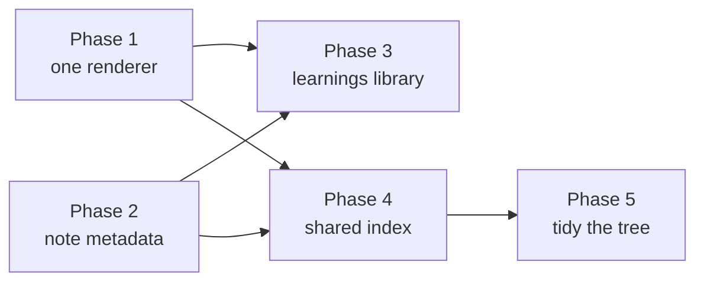

# Notes & Learnings Refactor Plan

Status: **partly implemented**. This proposal was written on 2026-07-27.
Notes now have area landing pages and grouped sidebar navigation. Renderer
consolidation, note metadata and the shared cross-vault index remain proposals;
`LabMarkdown.tsx` and `SimpleMarkdown.tsx` still exist.

This is a live plan, not documentation. It moves to the [archive](../archive/README.md)
when it ships.

---

## Why now

The docs refactor solved a specific problem: a knowledge surface that stored good
content but presented it as a filesystem. Notes and Learnings have the *same*
problem and the *same* shape, and we now have the parts to fix it.

What the docs work actually produced, and how much of it transfers:

| Part | Transfers to notes/learnings? |
| ---- | ----------------------------- |
| `lib/docs/markdown-ast.ts` — Markdown to typed AST | Yes, via `blocksToText` |
| `components/docs/DocContent.tsx` — AST renderer | Yes |
| `components/docs/DocToc.tsx` — contents + scroll spy | Yes, unchanged |
| `lib/docs/doc-search.ts` — heading-scoped search | Yes, needs a different corpus builder |
| Backlink graph in `lib/docs/doc-index.ts` | Yes, and this is the biggest win |
| `lib/docs/frontmatter.ts` | **No.** Notes are JSON; metadata needs a different home |
| Section config in `doc-sections.ts` | Partly — the pattern, not the table |

> [!IMPORTANT]
> Notes and Learnings are BlockNote JSON, not Markdown. Everything below assumes
> that stays true. Converting the vault to Markdown would be a bigger, riskier
> change that buys less than it looks like: the editor is the reason the vault is
> JSON, and the editor is the thing people actually use.

---

## What's wrong today

These were the gaps recorded for the original proposal; shipped changes are noted below.

### Learnings

`app/learnings/client.tsx` is 122 lines doing what the docs index used to do:

- **No metadata.** Title is "first line of the file with `#` stripped".
  Preview is "first three body lines". Category is the file path. There is no
  way to say what a learning is *about* without renaming the file.
- **Flat list + accordion.** Entries render as one list with a client-side
  `includes()` filter across three fields. No grouping, no ordering, no relations.
- **No cross-linking.** A learning that supersedes another has no way to say so.
- **Detail rendering via `SimpleMarkdown`** → `LabMarkdown`, a 200-line regex
  renderer that handles bold/italic/code and little else. No tables, no callouts,
  no diagrams, no heading anchors.

### Notes

- **Browsing now has areas and sections** (`lib/notes/note-index.ts`), so the
  original flat-list gap is closed. The metadata and cross-vault work below
  still needs a design and implementation.
- **Search is better than docs' was** (lexical TF-IDF in
  `shared/notes-search/lexical.ts`) but the command palette still labels hits with
  file paths, and results land at the top of the note rather than the match.
- **No backlinks.** Daily notes reference learnings, PR reviews reference repos,
  sessions reference both. None of it is navigable.

### Two markdown renderers

`LabMarkdown` (5 call sites: research, appraisal, repos/learn, learnings, radar)
and the new docs AST renderer now coexist. That is one renderer too many — but
note `LabMarkdown` has one thing the docs renderer does not: it turns
file-path-looking `code` tokens into "open in Cursor" deep links. That feature
must survive consolidation, not get dropped on the floor.

---

## Phases

Ordered so each phase ships independently and the risky one comes last.

### Phase 1 — One markdown renderer

**Goal:** delete `LabMarkdown`, route its five call sites through the docs AST
renderer.

- Promote `lib/docs/markdown-ast.ts` and `components/docs/DocContent.tsx` out of
  the docs namespace: `lib/markdown/ast.ts`, `components/markdown/Markdown.tsx`.
  Keep the docs modules as thin re-exports so the docs PR stays reviewable.
- Port the Cursor-link behaviour as an opt-in prop: `<Markdown linkRepoFiles>`.
  It belongs in the inline `code` branch of the renderer, gated so docs pages
  don't start linking every backtick to an editor.
- Add a `compact` variant covering `LabMarkdown`'s preview styling.
- Migrate call sites one at a time; each is independently revertible.

**Done when:** `LabMarkdown.tsx` and `SimpleMarkdown.tsx` are deleted, and
research / appraisal / repos-learn / learnings / radar render tables, callouts
and diagrams they previously could not.

**Risk:** low. Additive, with five isolated call sites.

---

### Phase 2 — Note metadata

**Goal:** give notes and learnings the thing frontmatter gave docs, without
turning them into Markdown.

The vault is BlockNote JSON. A JSON document can carry a metadata object
natively — it does not need a `---` block, and inventing one inside JSON would
be worse than the problem.

```
{
  "meta": { "title": "...", "tags": [...], "related": [...], "supersedes": "..." },
  "blocks": [ ... ]
}
```

- **Back-compat is mandatory.** Existing files can be bare block arrays. The
  reader must accept both shapes: an array is `{ meta: {}, blocks: array }`.
  This mirrors how `migrateNoteBlocks` already tolerates legacy collection
  blocks — the precedent exists.
- Write it in `shared/vault/` so the MCP server sees the same shape as the
  dashboard. Getting this wrong means notes written by an agent lose metadata.
- Editor surface: a collapsible metadata strip above the editor (title, tags,
  related), not a modal. Docs proved that metadata people cannot see is metadata
  people do not maintain.
- Derive-then-persist: on first save, backfill `title` from the first heading so
  existing notes get metadata without a migration pass.

**Done when:** a note can carry tags and relations, old files still open, and the
MCP tools round-trip metadata.

**Risk:** medium — it touches the storage layer shared with MCP. Needs tests on
both shapes before anything writes.

> [!WARNING]
> Do **not** run a bulk migration over `notes/`. It holds personal data.
> Backfill lazily on save instead.

---

### Phase 3 — Learnings as a real library

**Goal:** what docs got, applied to learnings.

- Landing page with sections derived from the top-level category folder, cards
  with descriptions from `meta.title` / `meta.summary`, and recency.
- Detail view: full-page route (`/learnings/<category>`) instead of an inline
  accordion, with contents, tags and related learnings.
- Replace the client-side substring filter with the heading-scoped search from
  Phase 4.
- `supersedes` / `superseded-by` relations rendered as a banner. A learning that
  has been replaced should say so at the top, not silently mislead.

**Done when:** learnings are navigable by topic and relation rather than by
scrolling one list.

**Risk:** low. New routes over existing data.

---

### Phase 4 — Shared knowledge index

**Goal:** generalise `lib/docs/doc-index.ts` into one index across docs, notes
and learnings.

This is where the real value is. Today the three vaults cannot see each other; a
daily note referencing a learning is a dead end.

- Extract the index into `lib/knowledge/`: corpus building, heading chunking,
  link resolution, backlinks, prev/next.
- Vault adapters supply "how do I get Markdown text and metadata from this
  file" — Markdown for docs, `blocksToText` for notes and learnings.
- Cross-vault links: a note linking `/docs/architecture/plugins` produces a
  backlink on that doc, and vice versa. The docs link resolver already handles
  app-absolute `/docs/...` hrefs; it needs the same for `/notes/...`.
- One search endpoint over all three, with a vault filter.
- Command palette consumes it — one ranked result set instead of the current
  three parallel fetches.

**Done when:** searching once finds the doc, the note and the learning, and every
page shows what references it.

**Risk:** medium. Mostly a refactor of tested code, but the index is now on the
hot path for four surfaces. Keep the mtime-signature cache; it is what makes the
docs index cheap.

---

### Phase 5 — Tidy the tree

**Goal:** the content cleanup, done last so tooling exists to verify it.

- Let each user review empty or duplicate folders in their own vault.
- Keep paths referenced by skills working when files move.
- Decide how generated review notes should appear in browsing and search.
- Extend the docs-tree integrity test to notes: dead relations, unresolvable
  `supersedes`, notes with no title after backfill.

**Risk:** low, but it is personal data — every move is a `git mv` with a
reviewable diff, no scripted bulk edits.

---

## Sequencing



Phases 1 and 2 are independent and can run in either order. Phase 1 is the
cheaper win and the better warm-up.

---

## Lessons from the docs refactor worth repeating

**Guardrails before content.** The link-integrity test found nine broken links
the moment it existed, several of them long-standing. Write the test first this
time.

**Silent failures are the expensive ones.** A Mermaid diagram with a bad theme
variable rendered as an empty box with nothing in the console, and cost more time
than everything else combined. Anything that renders asynchronously needs a
validator that runs headlessly — `npm run docs:diagrams` is the template.

**Validate with the real config.** The first diagram checker passed because it
used Mermaid's defaults, not the app's theme. A check that does not exercise the
production configuration is a check that lies.

**Round-trips eat metadata.** The docs editor destroyed frontmatter on save
because Markdown → BlockNote → Markdown is lossy. Phase 2 walks straight into the
same hazard from the other direction. Test the round-trip before shipping the
writer.

**Derived beats declared.** Deleting `SUMMARY.md` and deriving nav from the
filesystem plus frontmatter removed a file that was permanently one edit behind
reality. Resist adding an index file for notes.

**Don't guess at runtime behaviour.** Several dead ends came from theorising
about why something did not render instead of instrumenting it. Add the probe.

---

## Explicitly out of scope

- Converting the notes vault from BlockNote JSON to Markdown.
- Embeddings or semantic search. The current lexical TF-IDF is good, and
  `mode=semantic` is already a misnomer for it — worth renaming, not replacing.
- Touching `tasks/`, `collections/` or `upstarts/`.
- Any bulk rewrite of files under `notes/`.
